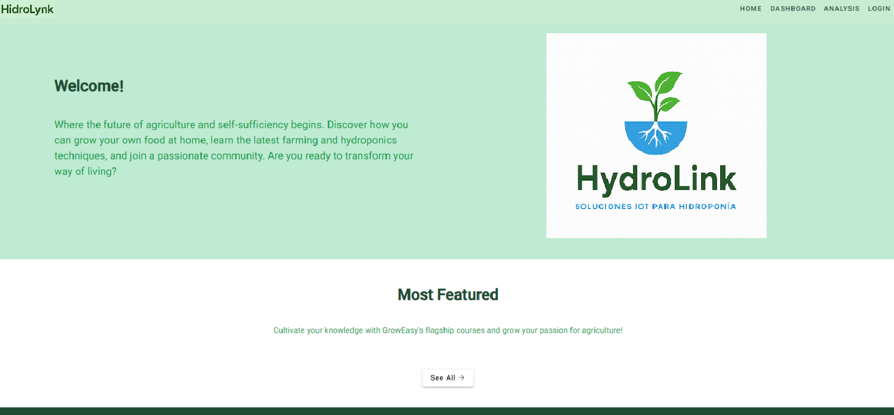
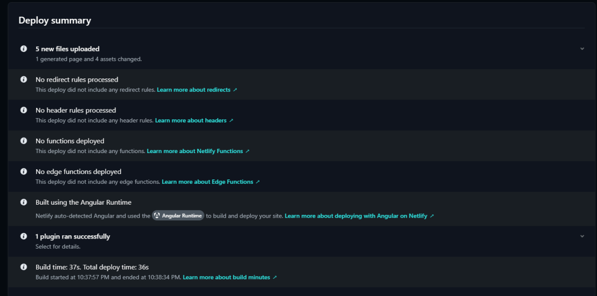
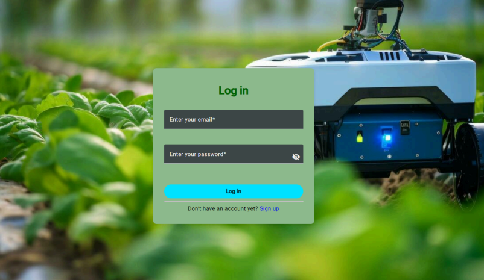

# Capítulo V: Product Implementation

## 5.1. Software Configuration Management
El entorno de desarrollo de HidroLynk se configuró para garantizar un flujo de trabajo eficiente y colaborativo en el equipo. Se seleccionaron herramientas estándar de la industria para programación, control de versiones y gestión de proyectos, facilitando la integración continua y la comunicación efectiva entre los miembros del equipo.

Para la programación se utilizó principalmente Visual Studio Code, optimizado con extensiones esenciales que mejoraron la productividad, como ESLint y Prettier, asegurando coherencia y limpieza en el código. La comunicación del equipo se gestionó a través de Slack, mientras que las reuniones y seguimiento de progreso se llevaron a cabo mediante Zoom y Jira, respectivamente.

### 5.1.1. Software Development Environment Configuration

Esta sección describe las herramientas y plataformas adoptadas por nuestro equipo para facilitar la colaboración efectiva durante todas las etapas del desarrollo del producto, utilizando metodologías ágiles.

### Project Management

- **Discord**: Originalmente una plataforma orientada a comunidades gamer, actualmente Discord es empleada para fomentar la comunicación y colaboración efectiva entre los miembros del equipo gracias a sus funcionalidades para crear espacios grupales interactivos.

- **WhatsApp**: Es una herramienta principalmente orientada a la mensajería instantánea que permite al equipo mantener una comunicación fluida en tiempo real, facilitando conversaciones rápidas y resoluciones inmediatas, aunque no esté específicamente diseñada para gestionar proyectos.

### Requirements Management

- **Google Docs**: Es una suite basada en la nube que incluye herramientas de texto, hojas de cálculo y presentaciones. Aunque no es exclusivamente para la gestión de requisitos, facilita la colaboración simultánea y documentación de los requerimientos del proyecto.

- **Miro**: Plataforma colaborativa en línea orientada a la visualización. Su principal valor radica en permitir la creación conjunta de diagramas, mapas mentales, wireframes y prototipos visuales, fortaleciendo así el proceso de planificación e ideación.

- **LucidChart**: Herramienta online dedicada a la creación visual colaborativa, que permite generar diagramas de flujo, organigramas y otras representaciones gráficas que ayudan a definir y comprender mejor los procesos del proyecto.

- **Structurizr**: Aplicación web especializada en documentar y gestionar la arquitectura del software mediante modelos gráficos interactivos. Esta herramienta garantiza la coherencia arquitectónica y facilita el entendimiento compartido del diseño del sistema.

### Product UX/UI Design

- **Figma**: Plataforma basada en la nube utilizada para diseñar interfaces de usuario (UI) y experiencias de usuario (UX), permitiendo al equipo crear diseños interactivos, prototipos realistas y colaborar en tiempo real en las diferentes etapas del diseño.

- **UXPressia**: Herramienta enfocada en la visualización de experiencias de usuario, ofreciendo funcionalidades para crear mapas de viaje del usuario, perfiles de clientes y otros elementos visuales que enriquecen el proceso de diseño centrado en las necesidades del usuario.

### Software Development

- **IntelliJ IDEA**: Entorno de desarrollo integrado (IDE) desarrollado por JetBrains, que destaca por su soporte avanzado para Java, Kotlin y otros lenguajes de la plataforma JVM, facilitando el desarrollo eficiente y productivo del código.

- **Visual Studio Code**: Editor de código multiplataforma creado por Microsoft, compatible con múltiples lenguajes de programación y equipado con herramientas potentes de depuración, integración continua y gestión eficiente del control de versiones.

- **Wokwi**: Simulador online especializado en electrónica, enfocado principalmente en plataformas como Arduino y ESP32. Proporciona un entorno virtual en el que el equipo puede diseñar, programar y testear circuitos sin necesidad de componentes físicos.

- **Git**: Sistema distribuido de control de versiones que permite gestionar eficientemente los cambios del código fuente. Es una tecnología clave que favorece la colaboración, permitiendo a múltiples desarrolladores trabajar simultáneamente sin interferencias.

### Software Documentation

- **GitHub**: Plataforma colaborativa basada en el sistema de control de versiones Git, que facilita almacenar, gestionar y revisar el código fuente. GitHub mejora significativamente la comunicación y el flujo de trabajo entre los desarrolladores, favoreciendo la documentación clara y centralizada del proyecto.

### 5.1.2. Source Code Management
Para mantener una estructura clara y evitar conflictos o duplicidad de trabajo durante el desarrollo, los proyectos han sido organizados utilizando GitHub. Se ha creado una organización dedicada al proyecto HydroLink, que contiene repositorios específicos para cada componente de la solución, detallados a continuación:

- **Repositorio de la Landing Page:** [https://github.com/1ASI0732-4433-G3/Landing-Page](https://github.com/1ASI0732-4433-G3/Landing-Page)
- **Repositorio de la Aplicación Web:** [https://github.com/1ASI0732-4433-G3/Web-Page](https://github.com/1ASI0732-4433-G3/Web-Page)

Estos repositorios serán gestionados mediante el modelo Gitflow, un flujo de trabajo que optimiza el proceso colaborativo y agiliza la integración de código, ayudando a mantener el desarrollo organizado y fluido.

- **Main:** Rama principal destinada a publicar versiones estables y completas del proyecto, asegurando que sean libres de errores. Representa la versión oficial que se despliega y es visible para los usuarios finales.

- **Develop:** Es la rama base donde se integran continuamente las nuevas funcionalidades desarrolladas durante los distintos sprints.

- **Feature:** Estas ramas específicas son creadas a partir de la rama `develop` cada vez que se desea implementar una funcionalidad adicional. Es importante fusionarlas de vuelta a `develop` frecuentemente, minimizando conflictos y facilitando la integración del trabajo realizado.

### 5.1.3. Source Code Style Guide & Conventions
Para asegurar la coherencia, claridad y facilidad de mantenimiento del código fuente, el equipo de HydroLink ha establecido una serie de convenciones y buenas prácticas para cada uno de los lenguajes y tecnologías empleadas en el desarrollo del proyecto:

### HTML

HTML es el lenguaje base utilizado para estructurar el contenido de nuestras interfaces web. Con el fin de mantener un código limpio y comprensible, se sigue una serie de recomendaciones:
- Uso uniforme de espacios o tabulaciones.
- Las etiquetas y nombres de archivo deben escribirse en minúsculas.
- Atributos HTML encerrados entre comillas dobles.
- Inclusión correcta de archivos CSS y JS mediante las etiquetas `<link>` y `<script>`.
- Cierre adecuado de todas las etiquetas y uso de comentarios con la sintaxis `<!-- comentario -->`.

### CSS

CSS permite aplicar estilos visuales a los elementos HTML. Para garantizar una presentación ordenada y bien definida, se aplican las siguientes prácticas:
- Uso de nombres de clases en minúsculas, descriptivos y con significado claro.
- Agrupación lógica de propiedades relacionadas.
- Empleo de IDs solo cuando sea necesario aplicar estilos únicos.
- Mantener una indentación clara para mejorar la lectura del código.

### JavaScript

JavaScript añade interactividad y dinamismo a nuestras aplicaciones. Se siguen las siguientes convenciones para mantener la calidad del código:
- Nombres de variables y funciones expresivos, sin abreviaciones, escritos en camelCase.
- Separación de funciones complejas en bloques más pequeños y reutilizables.
- Uso de comentarios que expliquen procesos relevantes.
- Organización modular cuando sea posible.

### Angular

Angular es el framework principal utilizado en el desarrollo de la aplicación web de HydroLink. Sus buenas prácticas incluyen:
- Uso de nombres de archivos y componentes descriptivos, empleando guiones para separar palabras.
- Estructuración del proyecto en carpetas bien definidas (componentes, servicios, módulos).
- Separación de lógica de presentación y lógica de negocio para mantener la limpieza arquitectónica.
- Adherencia al estándar de TypeScript, incluyendo tipado explícito y uso de interfaces.

### Gherkin

Gherkin es el lenguaje empleado para describir escenarios de prueba de forma legible por todos los miembros del equipo. Se adoptan las siguientes reglas:
- Empleo de palabras clave como `Given`, `When`, `Then` y `And` para estructurar los pasos.
- Redacción clara y enfocada en la intención del usuario o comportamiento del sistema.
- Uso de tablas para representar entradas y salidas de manera estructurada.
- Inclusión de comentarios solo cuando agregan valor (líneas que inician con `#`).
- Cada archivo `.feature` debe centrarse en una sola funcionalidad, compuesta por uno o más escenarios.

Estas directrices fueron seleccionadas para mantener la calidad técnica del proyecto y facilitar la colaboración entre los distintos roles del equipo, desde desarrolladores hasta diseñadores y testers.

### 5.1.4. Software Deployment Configuration
A continuación, se detallan los procedimientos seguidos por el equipo de HydroLink para poner en línea las soluciones desarrolladas durante esta etapa del proyecto.

### Landing Page

El despliegue de la página principal se llevó a cabo mediante **GitHub Pages**, una funcionalidad integrada en GitHub que permite alojar sitios estáticos directamente desde los repositorios del proyecto. Para ello, el código fuente se organizó dentro del repositorio correspondiente, y se activó la opción de publicación desde la configuración del repositorio, lo que generó automáticamente un enlace público de acceso al sitio.

### Web Application

La aplicación web fue desplegada usando **Firebase Hosting**, una solución de Google pensada para el alojamiento de aplicaciones modernas. Esta herramienta permite publicar sitios de manera rápida y segura, brindando la posibilidad de conectar el frontend del proyecto con servicios backend y bases de datos en la nube. Utilizamos Firebase para asegurar la disponibilidad en línea de nuestra interfaz, con un rendimiento optimizado y una configuración sencilla para entornos productivos.

## 5.2. Product Implementation & Deployment

### 5.2.1. Sprint Backlogs

### 5.2.2. Implemented Landing Page Evidence

En esta etapa del proyecto, se completó el desarrollo inicial de la **Landing Page**, cumpliendo con los objetivos establecidos para la captación de usuarios e introducción al producto.

Asimismo, se avanzó con la construcción de la **versión preliminar de la aplicación web**, permitiendo visualizar la estructura general y navegar entre sus componentes principales.

### 5.2.3. Implemented Frontend-Web Application Evidence
En esta fase del proyecto se completó la implementación de la aplicación web.

### 5.2.4. Implemented Native-Mobile Application Evidence
En esta fase del proyecto se completó la implementación de la aplicación movil.

### 5.2.5. Implemented RESTful API and/or Serverless Backend Evidence

### 5.2.6. RESTful API documentation

### 5.2.7. Team Collaboration Insights

## 5.3. Video About-the-Product

