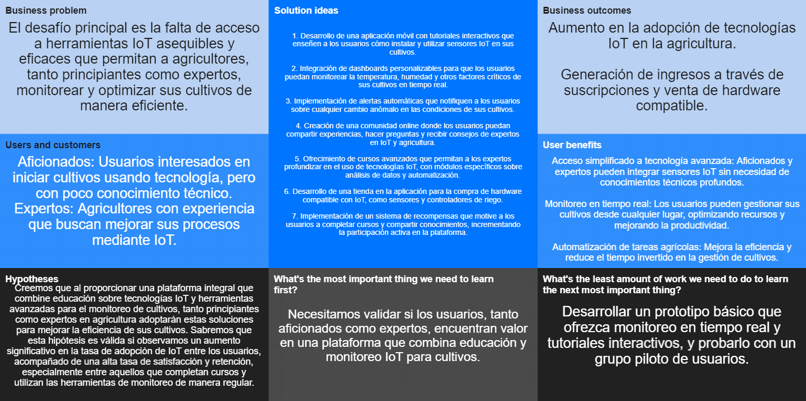
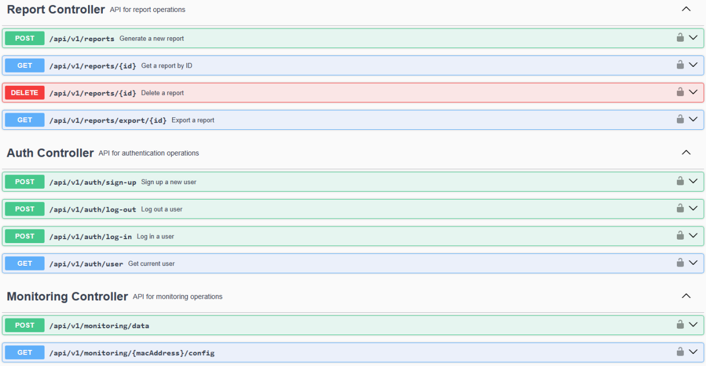

<div align="center">


# Universidad Peruana de Ciencias Aplicadas

### Ingeniería de Software
### Ciclo 2024-02

---

# **Desarrollo de Soluciones IoT**

## TF REPORT

**Sección:** 4433  
**Profesor:** Juan Carlos Tinoco Licas
**Startup Name:** HydroGenius  
**Producto:** HydroLink

<h3 align="center">Team Members</h3>

<div align="center">
  <table border="1" cellpadding="6" cellspacing="0">
    <thead>
      <tr>
        <th>Member</th>
        <th>Code</th>
      </tr>
    </thead>
    <tbody>
      <tr>
        <td>Hidalgo Bustamante, Josue Omar</td>
        <td>u202119880</td>
      </tr>
      <tr>
        <td>Martinez Valdivia, José Luis </td>
        <td>u202213989</td>
      </tr>
      <tr>
        <td>Mel Andree Orellana Rodriguez</td>
        <td>u202014468</td>
      </tr>
      <tr>
        <td>Arana Ramos, Jack</td>
        <td>u202121875</td>
      </tr>
    </tbody>
  </table>
</div>


</div>

<br>

Abril del 2025

<br>

[Video de Exposición TF]()

---

## Registro de Versiones del Informe

| Versión |   Fecha    |                   Autor(es)                    | Descripción de modificación                                                                                                                                                                                                                                               |
| :-----: | :--------: |:----------------------------------------------:|:--------------------------------------------------------------------------------------------------------------------------------------------------------------------------------------------------------------------------------------------------------------------------|
| **TB1** | 26/04/2025 |-Josue Hidalgo Bustamante  <br> - Mel Andree Orellana <br> - José Luis Martínez Valdivia | Se realizaron los capítulos:<br>- **Capítulo I:** Introducción<br>- **Capítulo II:** Requirements Elicitation & Analysis<br>- **Capítulo III:** Requirements Specification<br>- **Capítulo IV:** Product Design <br>- **Capítulo V:** Product Implementation |

---

## Project Report Collaboration Insights

- **TB1:** Para esta entrega, realizamos las actividades correspondientes a los capítulos asignados en nuestro repositorio:

[Github - Informe Final HydroLink](https://github.com)

<br>

### Capturas de evidencia:

- **Capítulo I:** Introducción (Josue Hidalgo)
- **Capítulo II:** Requirements Elicitation & Analysis (Farid Rolando)
- **Capítulo III:** Requirements Specification (Jesús Antonio)
- **Capítulo IV:** Solution Software Design (Jack)
- **Capítulo V:** Product Implementation (Josue Hidalgo)


---


# Contenido

## Tabla de Contenidos

### [Capítulo I: Introducción](#capítulo-i-introducción)
- [1.1. Startup Profile](#11-startup-profile)
  - [1.1.1. Descripción de la Startup](#111-descripción-de-la-startup)
  - [1.1.2. Perfiles de integrantes del equipo](#112-perfiles-de-integrantes-del-equipo)
- [1.2. Solution Profile](#12-solution-profile)
  - [1.2.1. Antecedentes y problemática](#121-antecedentes-y-problemática)
  - [1.2.2. Lean UX Process](#122-lean-ux-process)
    - [1.2.2.1. Lean UX Problem Statements](#1221-lean-ux-problem-statements)
    - [1.2.2.2. Lean UX Assumptions](#1222-lean-ux-assumptions)
    - [1.2.2.3. Lean UX Hypothesis Statements](#1223-lean-ux-hypothesis-statements)
    - [1.2.2.4. Lean UX Canvas](#1224-lean-ux-canvas)
- [1.3. Segmentos objetivo](#13-segmentos-objetivo)

### [Capítulo II: Requirements Elicitation & Analysis](#capítulo-ii-requirements-elicitation--analysis)
- [2.1. Competidores](#21-competidores)
  - [2.1.1. Análisis competitivo](#211-análisis-competitivo)
  - [2.1.2. Estrategias y tácticas frente a competidores](#212-estrategias-y-tácticas-frente-a-competidores)
- [2.2. Entrevistas](#22-entrevistas)
  - [2.2.1. Diseño de entrevistas](#221-diseño-de-entrevistas)
  - [2.2.2. Registro de entrevistas](#222-registro-de-entrevistas)
  - [2.2.3. Análisis de entrevistas](#223-análisis-de-entrevistas)
- [2.3. Needfinding](#23-needfinding)
  - [2.3.1. User Personas](#231-user-personas)
  - [2.3.2. User Task Matrix](#232-user-task-matrix)
  - [2.3.3. User Journey Mapping](#233-user-journey-mapping)
  - [2.3.4. Empathy Mapping](#234-empathy-mapping)
  - [2.3.5. As-is Scenario Mapping](#235-as-is-scenario-mapping)
- [2.4. Ubiquitous Language](#24-ubiquitous-language)

### [Capítulo III: Requirements Specification](#capítulo-iii-requirements-specification)
- [3.1. To-Be Scenario Mapping](#31-to-be-scenario-mapping)
- [3.2. User Stories](#32-user-stories)
- [3.3. Product Backlog](#33-product-backlog)
- [3.4. Impact Mapping](#34-impact-mapping)

### [Capítulo IV: Product Design](#capítulo-iv-product-design)
- [4.1. Style Guidelines](#41-style-guidelines)
  - [4.1.1. General Style Guidelines](#411-general-style-guidelines)
  - [4.1.2. Web Style Guidelines](#412-web-style-guidelines)
  - [4.1.3. Mobile Style Guidelines](#413-mobile-style-guidelines)
    - [4.1.3.1. iOS Mobile Style Guidelines](#4131-ios-mobile-style-guidelines)
    - [4.1.3.2. Android Mobile Style Guidelines](#4132-android-mobile-style-guidelines)
- [4.2. Information Architecture](#42-information-architecture)
  - [4.2.1. Organization Systems](#421-organization-systems)
  - [4.2.2. Labeling Systems](#422-labeling-systems)
  - [4.2.3. SEO Tags and Meta Tags](#423-seo-tags-and-meta-tags)
  - [4.2.4. Searching Systems](#424-searching-systems)
  - [4.2.5. Navigation Systems](#425-navigation-systems)
- [4.3. Landing Page UI Design](#43-landing-page-ui-design)
  - [4.3.1. Landing Page Wireframe](#431-landing-page-wireframe)
  - [4.3.2. Landing Page Mock-up](#432-landing-page-mock-up)
- [4.4. Mobile Applications UX/UI Design](#44-mobile-applications-uxui-design)
  - [4.4.1. Mobile Applications Wireframes](#441-mobile-applications-wireframes)
  - [4.4.2. Mobile Applications Wireflow Diagrams](#442-mobile-applications-wireflow-diagrams)
  - [4.4.3. Mobile Applications Mock-ups](#443-mobile-applications-mock-ups)
  - [4.4.4. Mobile Applications User Flow Diagrams](#444-mobile-applications-user-flow-diagrams)
- [4.5. Mobile Applications Prototyping](#45-mobile-applications-prototyping)
  - [4.5.1. Android Mobile Applications Prototyping](#451-android-mobile-applications-prototyping)
  - [4.5.2. iOS Mobile Applications Prototyping](#452-ios-mobile-applications-prototyping)
- [4.6. Web Applications UX/UI Design](#46-web-applications-uxui-design)
  - [4.6.1. Web Applications Wireframes](#461-web-applications-wireframes)
  - [4.6.2. Web Applications Wireflow Diagrams](#462-web-applications-wireflow-diagrams)
  - [4.6.3. Web Applications Mock-ups](#463-web-applications-mock-ups)
  - [4.6.4. Web Applications User Flow Diagrams](#464-web-applications-user-flow-diagrams)
- [4.7. Web Applications Prototyping](#47-web-applications-prototyping)
- [4.8. Domain-Driven Software Architecture](#48-domain-driven-software-architecture)
  - [4.8.1. Software Architecture Context Diagram](#481-software-architecture-context-diagram)
  - [4.8.2. Software Architecture Container Diagrams](#482-software-architecture-container-diagrams)
  - [4.8.3. Software Architecture Components Diagrams](#483-software-architecture-components-diagrams)
- [4.9. Software Object-Oriented Design](#49-software-object-oriented-design)
  - [4.9.1. Class Diagrams](#491-class-diagrams)
  - [4.9.2. Class Dictionary](#492-class-dictionary)
- [4.10. Database Design](#410-database-design)
  - [4.10.1. Relational/Non-Relational Database Diagram](#4101-relationalnon-relational-database-diagram)

### [Capítulo V: Product Implementation](#capítulo-v-product-implementation)
- [5.1. Software Configuration Management](#51-software-configuration-management)
  - [5.1.1. Software Development Environment Configuration](#511-software-development-environment-configuration)
  - [5.1.2. Source Code Management](#512-source-code-management)
  - [5.1.3. Source Code Style Guide & Conventions](#513-source-code-style-guide--conventions)
  - [5.1.4. Software Deployment Configuration](#514-software-deployment-configuration)
- [5.2. Product Implementation & Deployment](#52-product-implementation--deployment)
  - [5.2.1. Sprint Backlogs](#521-sprint-backlogs)
  - [5.2.2. Implemented Landing Page Evidence](#522-implemented-landing-page-evidence)
  - [5.2.3. Implemented Frontend-Web Application Evidence](#523-implemented-frontend-web-application-evidence)
  - [5.2.4. Implemented Native-Mobile Application Evidence](#524-implemented-native-mobile-application-evidence)
  - [5.2.5. Implemented RESTful API and/or Serverless Backend Evidence](#525-implemented-restful-api-andor-serverless-backend-evidence)
  - [5.2.6. RESTful API documentation](#526-restful-api-documentation)
  - [5.2.7. Team Collaboration Insights](#527-team-collaboration-insights)
- [5.3. Video About-the-Product](#53-video-about-the-product)

### [Capítulo VI: Product Verification & Validation](#capítulo-vi-product-verification--validation)
- [6.1. Testing Suites & Validation](#61-testing-suites--validation)
  - [6.1.1. Core Entities Unit Tests](#611-core-entities-unit-tests)
  - [6.1.2. Core Integration Tests](#612-core-integration-tests)
  - [6.1.3. Core Behavior-Driven Development](#613-core-behavior-driven-development)
  - [6.1.4. Core System Tests](#614-core-system-tests)
- [6.2. Static testing & Verification](#62-static-testing--verification)
  - [6.2.1. Static Code Analysis](#621-static-code-analysis)
    - [6.2.1.1. Coding standard & Code conventions](#6211-coding-standard--code-conventions)
    - [6.2.1.2. Code Quality & Code Security](#6212-code-quality--code-security)
  - [6.2.2. Reviews](#622-reviews)
- [6.3. Validation Interviews](#63-validation-interviews)
  - [6.3.1. Diseño de Entrevistas](#631-diseño-de-entrevistas)
  - [6.3.2. Registro de Entrevistas](#632-registro-de-entrevistas)
  - [6.3.3. Evaluaciones según heurísticas](#633-evaluaciones-según-heurísticas)
- [6.4. Auditoría de Experiencias de Usuario](#64-auditoría-de-experiencias-de-usuario)
  - [6.4.1. Auditoría realizada](#641-auditoría-realizada)
    - [6.4.1.1. Información del grupo auditado](#6411-información-del-grupo-auditado)
    - [6.4.1.2. Cronograma de auditoría realizada](#6412-cronograma-de-auditoría-realizada)
    - [6.4.1.3. Contenido de auditoría realizada](#6413-contenido-de-auditoría-realizada)
  - [6.4.2. Auditoría recibida](#642-auditoría-recibida)
    - [6.4.2.1. Información del grupo auditor](#6421-información-del-grupo-auditor)
    - [6.4.2.2. Cronograma de auditoría recibida](#6422-cronograma-de-auditoría-recibida)
    - [6.4.2.3. Contenido de auditoría recibida](#6423-contenido-de-auditoría-recibida)
    - [6.4.2.4. Resumen de modificaciones para subsanar hallazgos](#6424-resumen-de-modificaciones-para-subsanar-hallazgos)

### [Capítulo VII: DevOps Practices](#capítulo-vii-devops-practices)
- [7.1. Continuous Integration](#71-continuous-integration)
  - [7.1.1. Tools and Practices](#711-tools-and-practices)
  - [7.1.2. Build & Test Suite Pipeline Components](#712-build--test-suite-pipeline-components)
- [7.2. Continuous Delivery](#72-continuous-delivery)
  - [7.2.1. Tools and Practices](#721-tools-and-practices)
  - [7.2.2. Stages Deployment Pipeline Components](#722-stages-deployment-pipeline-components)
- [7.3. Continuous Deployment](#73-continuous-deployment)
  - [7.3.1. Tools and Practices](#731-tools-and-practices)
  - [7.3.2. Production Deployment Pipeline Components](#732-production-deployment-pipeline-components)
- [7.4. Continuous Monitoring](#74-continuous-monitoring)
  - [7.4.1. Tools and Practices](#741-tools-and-practices)
  - [7.4.2. Monitoring Pipeline Components](#742-monitoring-pipeline-components)
  - [7.4.3. Alerting Pipeline Components](#743-alerting-pipeline-components)
  - [7.4.4. Notification Pipeline Components](#744-notification-pipeline-components)

### [Capítulo VIII: Experiment-Driven Development](#capítulo-viii-experiment-driven-development)
- [8.1. Experiment Planning](#81-experiment-planning)
  - [8.1.1. As-Is Summary](#811-as-is-summary)
  - [8.1.2. Raw Material: Assumptions, Knowledge Gaps, Ideas, Claims](#812-raw-material-assumptions-knowledge-gaps-ideas-claims)
  - [8.1.3. Experiment-Ready Questions](#813-experiment-ready-questions)
  - [8.1.4. Question Backlog](#814-question-backlog)
  - [8.1.5. Experiment Cards](#815-experiment-cards)
- [8.2. Experiment Design](#82-experiment-design)
  - [8.2.1. Hypotheses](#821-hypotheses)
  - [8.2.2. Measures](#822-measures)
  - [8.2.3. Conditions](#823-conditions)
  - [8.2.4. Scale Calculations and Decisions](#824-scale-calculations-and-decisions)
  - [8.2.5. Methods Selection](#825-methods-selection)
  - [8.2.6. Data Analytics: Goals, KPIs and Metrics Selection](#826-data-analytics-goals-kpis-and-metrics-selection)
  - [8.2.7. Web and Mobile Tracking Plan](#827-web-and-mobile-tracking-plan)
- [8.3. Experimentation](#83-experimentation)
  - [8.3.1. To-Be User Stories](#831-to-be-user-stories)
  - [8.3.2. To-Be Product Backlog](#832-to-be-product-backlog)
  - [8.3.3. Pipeline-supported, Experiment-Driven To-Be Software Platform Lifecycle](#833-pipeline-supported-experiment-driven-to-be-software-platform-lifecycle)
    - [8.3.3.1. To-Be Sprint Backlogs](#8331-to-be-sprint-backlogs)
    - [8.3.3.2. Implemented To-Be Landing Page Evidence](#8332-implemented-to-be-landing-page-evidence)
    - [8.3.3.3. Implemented To-Be Frontend-Web Application Evidence](#8333-implemented-to-be-frontend-web-application-evidence)
    - [8.3.3.4. Implemented To-Be Native-Mobile Application Evidence](#8334-implemented-to-be-native-mobile-application-evidence)
    - [8.3.3.5. Implemented To-Be RESTful API and/or Serverless Backend Evidence](#8335-implemented-to-be-restful-api-andor-serverless-backend-evidence)
    - [8.3.3.6. Team Collaboration Insights](#8336-team-collaboration-insights)
  - [8.3.4. To-Be Validation Interviews](#834-to-be-validation-interviews)
    - [8.3.4.1. Diseño de Entrevistas](#8341-diseño-de-entrevistas)
    - [8.3.4.2. Registro de Entrevistas](#8342-registro-de-entrevistas)
- [8.4. Experiment Aftermath & Analysis](#84-experiment-aftermath--analysis)
  - [8.4.1. Analysis and Interpretation of Results](#841-analysis-and-interpretation-of-results)
  - [8.4.2. Re-scored and Re-prioritized Question Backlog](#842-re-scored-and-re-prioritized-question-backlog)
- [8.5. Continuous Learning](#85-continuous-learning)
  - [8.5.1. Shareback Session Artifacts: Learning Workflow](#851-shareback-session-artifacts-learning-workflow)
- [8.6. To-Be Software Platform Pre-launch](#86-to-be-software-platform-pre-launch)
  - [8.6.1. About-the-Product Intro Video](#861-about-the-product-intro-video)

### [Conclusiones](#conclusiones)
- [Conclusiones y recomendaciones](#conclusiones-y-recomendaciones)
- [Video About-the-Team](#video-about-the-team)


## Student Outcome  - remplazar 

| Criterio específico | Acciones realizadas                                                                                                                                                                                                                                                                                                                                                                                                                                                                                                                                                                                                                                                                                                                                                                        | Conclusiones |
| :------------------: |:-------------------------------------------------------------------------------------------------------------------------------------------------------------------------------------------------------------------------------------------------------------------------------------------------------------------------------------------------------------------------------------------------------------------------------------------------------------------------------------------------------------------------------------------------------------------------------------------------------------------------------------------------------------------------------------------------------------------------------------------------------------------------------------------| :---------- |
| Reconoce responsabilidad ética y profesional en situaciones de ingeniería de software | **Josue Omar Hidalgo Bustamante <br> TB1:<br>** Contribuí al equipo asegurando prácticas responsables en el desarrollo, promoviendo decisiones técnicas éticas, evaluando riesgos de escalabilidad y priorizando la calidad del software. Fomenté un enfoque colaborativo orientado a soluciones sostenibles y alineadas con los principios profesionales de la ingeniería. <br> <br> **Jack Arana Ramos** <br> **TB1:** <br> Al elaborar la especificación de requerimientos, estructuré los User Stories y el Product Backlog priorizando las necesidades reales de los usuarios, asegurando que las funcionalidades propuestas respeten principios éticos, de usabilidad y accesibilidad, fundamentales en el desarrollo responsable de software. <br> <br>  **Jose Luis Martínez Valdivia** <br> **TB1:** <br> Contribui con la realización de las entrevistas, lo cual permitió conocer mejor nuestros Segmentos Objetivos y el mercado al cual pretendemos llegar como StartUp                               | Colaboración efectiva y liderazgo compartido. Comunicación adaptada a distintos públicos. Resultados técnicos claros y prácticos. |
| Emite juicios informados considerando el impacto de las soluciones de ingeniería de software en contextos globales, económicos, ambientales y sociales | **Josue Omar Hidalgo Bustamante <br> TB1:<br>** Aporté al equipo evaluando nuestras soluciones considerando su viabilidad técnica y su impacto en el entorno social, económico y ambiental. Propuse decisiones informadas que equilibraran eficiencia, sostenibilidad y accesibilidad, alineando el desarrollo con necesidades reales en contextos globales y locales.   <br> <br>   **Mel Andree Orellana Rodriguez**<br>**TB1:**<br>En el área de Diseño Visual y Prototipado, trabajé en la creación de una propuesta visual coherente, aplicando principios de diseño que aseguraran una experiencia de usuario intuitiva. Además, diseñé y refiné prototipos interactivos que facilitaron la validación temprana de ideas.                  <br> <br> **Jack Arana Ramos** <br> **TB1:** <br> Durante la construcción del To-Be Scenario Map y del Impact Mapping, analicé y propuse soluciones orientadas a maximizar el valor para los usuarios y las partes interesadas, evaluando los posibles efectos de nuestras decisiones en diversos contextos, como el acceso equitativo a la tecnología, la eficiencia de recursos y la sostenibilidad del producto. <br> <br> **Jose Luis Martínez Valdivia** <br> **TB1:** <br> Aporte Al momento de conocer mejor nuestro público objetivo y saber cómo adaptar nuestro producto a ellos. Esto basándonos en sus necesidades y requerimientos. |Juicios equilibrados entre eficiencia, sostenibilidad y accesibilidad. Impacto positivo en usuarios, stakeholders y en la sostenibilidad a largo plazo. |

---


# Part I: As-Is Software Project

## Capítulo I: Introducción

### 1.1. Startup Profile

#### 1.1.1. Descripción de la Startup

Nuestra startup, **HydroLink**, nace con la finalidad de revolucionar el modo en que se gestionan los cultivos mediante el uso de tecnologías inteligentes. Nos enfocamos en ofrecer soluciones IoT que permitan a agricultores y entusiastas de la hidroponía tener un control detallado de su entorno agrícola. A través de nuestra plataforma, es posible recolectar información en tiempo real sobre factores como temperatura, humedad del ambiente, velocidad del viento e intensidad lumínica. Esta información es analizada para facilitar decisiones precisas orientadas a mejorar el rendimiento de los cultivos y garantizar una producción sostenible.

Nuestra propuesta no solo se basa en la tecnología, sino también en la accesibilidad: buscamos que cualquier persona, sin importar su nivel de conocimiento, pueda aprovechar herramientas avanzadas de monitoreo y gestión agrícola. Por ello, ofrecemos una interfaz amigable y adaptable tanto en plataformas móviles como web, promoviendo el uso de prácticas agrícolas eficientes desde cualquier lugar.

<div align=center>
          
</div>


- **Visión:** Convertirnos en referentes en la aplicación de tecnología IoT en la agricultura moderna, promoviendo un enfoque sostenible, inteligente y accesible para todos.

- **Misión:** Desarrollar y mantener soluciones digitales integrales que permitan una gestión precisa, remota y automatizada de cultivos, mejorando la productividad y reduciendo el impacto ambiental.

#### 1.1.2. Perfiles de integrantes del equipo

| Nombre                                                                                                                     | Código     | Carrera | Conocimiento y habilidades                                                                                                                                                                                                                                                                                                                             |
|----------------------------------------------------------------------------------------------------------------------------|------------|---------|--------------------------------------------------------------------------------------------------------------------------------------------------------------------------------------------------------------------------------------------------------------------------------------------------------------------------------------------------------|
|  <span >Josue Omar Hidalgo Bustamante</span> | u202119880 | Ingeniería de Software | Experiencia en desarrollo de software con lenguajes como Python, Java y C++, combinada con una sólida comprensión de arquitectura en la nube, redes y escalabilidad. Me destaco por mi capacidad de análisis, pensamiento lógico y liderazgo técnico orientado a construir soluciones eficientes y adaptables a escenarios reales de alto rendimiento. |
| <span style="color:blue">Jose Luis Martínez Valdivia </span>                                                                                    | U202213989 | Ingeniería de Software | Cuento con conocimiento en desarrollo de aplicaciones web a base de virtualizacion, los lenguajes en cuales me enfoco son C#, Python y Java. Me encuentro capacitado para el manejo de Dockers y Git|
|                      Mel Andree Orellana Rodriguez</span>                                                                                                      | u202116018 | Ingeniería de Software |Mi nombre es Mel Andree Orellana Rodríguez. Soy estudiante de la carrera de Ingeniería de Software en la UPC y actualmente me encuentro cursando el séptimo ciclo.Tengo conocimientos en C++ y estoy desarrollándome en JavaScript, lo que me ha permitido ampliar mis habilidades hacia el desarrollo web. Me considero una persona comprensiva, con buena capacidad de comunicación y trabajo en equipo. Siempre estoy dispuesta a aprender cosas nuevas y a seguir mejorando. Además, me gusta colaborar y apoyar en lo que pueda ser útil, especialmente en proyectos donde pueda aportar valor y seguir creciendo tanto a nivel profesional como personal.                                                                                                                                                                                                      |
|  <span>Jack Arana Ramos</span>                | U202121875 | Ingeniería de Software | Tengo experiencia en desarrollo web full stack, manejando tanto front-end como back-end. También estoy capacitado en prácticas de DevOps, control de versiones con Git, y diseño de interfaces de usuario eficientes. Mis habilidades analíticas y de trabajo en equipo, junto con una gestión eficaz del tiempo, me permiten adaptarme rápidamente a nuevas tecnologías y resolver problemas complejos de manera eficiente.                                                                                                                                                                                                                 |

### 1.2. Solution Profile

**Nombre del producto:** HydroLink

**Descripción del producto:** HydroLink es una solución tecnológica centrada en el monitoreo inteligente de cultivos, diseñada para facilitar el control de variables ambientales que impactan directamente en el crecimiento de las plantas. Nuestro sistema emplea sensores conectados a una plataforma central que permite a los usuarios recibir datos en tiempo real y tomar acciones desde sus dispositivos móviles o computadoras. Esta integración mejora la eficiencia de los cultivos y reduce el desperdicio de recursos como agua y energía.

El producto está enfocado tanto en agricultores expertos que desean optimizar sus procesos, como en personas que están iniciándose en la hidroponía y desean un acompañamiento tecnológico intuitivo y confiable. El diseño de la solución prioriza la experiencia del usuario, ofreciendo reportes, alertas y recomendaciones automatizadas.

**Modelo de negocio:** El enfoque comercial de HydroLink se sustenta en la venta directa de kits de sensores IoT, además de ofrecer planes de suscripción para acceder a funciones avanzadas dentro de la plataforma, tales como reportes analíticos, ajustes automáticos y comunidad de usuarios. También se contempla la incorporación de publicidad segmentada sobre productos agrícolas complementarios, generando valor adicional para los usuarios y aliados estratégicos.

### 1.2.1. Antecedentes y problemática

La gestión eficiente de cultivos ha sido una preocupación constante para agricultores en todo el mundo. En el Perú, donde la agricultura representa un pilar fundamental de la economía, aún existen muchas zonas con poco acceso a tecnología que facilite el monitoreo continuo de variables ambientales. A esto se suma que prácticas como la hidroponía, aunque cada vez más populares, aún no están del todo democratizadas en cuanto al uso de herramientas tecnológicas.

- **Who:** Usuarios comprometidos con la mejora de sus procesos agrícolas, ya sean nuevos en el ámbito de la hidroponía o profesionales que buscan incorporar soluciones digitales para elevar la productividad.

- **What:** La problemática se centra en la ausencia de herramientas integrales que permitan recopilar y analizar datos de cultivo de forma accesible, comprensible y útil para la toma de decisiones.

- **Where:** Tanto en zonas rurales como urbanas, donde los agricultores requieren monitoreo constante pero no cuentan con soluciones asequibles o fáciles de implementar.

- **When:** Durante todas las etapas del ciclo agrícola, desde la preparación del terreno hasta el seguimiento del desarrollo de las plantas.

- **Why:** Las soluciones actuales suelen ser costosas, difíciles de usar o no están adaptadas al contexto local. Esto genera una brecha tecnológica que limita la eficiencia y sostenibilidad de los cultivos.

- **How:** Mediante la implementación de sensores IoT conectados a una aplicación multiplataforma, los usuarios pueden tener un panorama completo del estado de sus cultivos y tomar decisiones basadas en datos.

- **How much:** Datos del INEI evidencian un crecimiento del empleo agrícola incluso durante contextos adversos, como la pandemia. Además, técnicas como la hidroponía —que puede reducir el uso de agua en hasta un 90%— refuerzan el potencial impacto positivo que puede generar una solución como HydroLink en eficiencia, ahorro y sostenibilidad.

### 1.2.2. Lean UX Process

#### 1.2.2.1. Lean UX Problem Statements

Aunque la hidroponía se presenta como una solución viable ante la escasez de recursos y el cambio climático, su adopción tecnológica aún enfrenta barreras. Muchos usuarios desconocen cómo implementar herramientas IoT de manera efectiva. Por eso, nos planteamos la siguiente pregunta: ¿Cómo podemos diseñar un sistema basado en IoT que sea comprensible, útil y adaptable tanto para agricultores novatos como para expertos en producción agrícola?

#### 1.2.2.2. Lean UX Assumptions

**Business outcomes:**
- Incremento en el uso de soluciones tecnológicas en agricultura urbana y rural.
- Aumento del valor percibido por la automatización y centralización de datos agrícolas.
- Mejora en la capacidad de decisión del agricultor gracias a la visualización de métricas en tiempo real.
- Reducción de errores por intervención manual y optimización del uso de recursos.
- Fidelización de usuarios mediante una experiencia personalizada.

**User assumptions:**
- Agricultores de diferentes niveles de experiencia que necesitan apoyo técnico simple.
- Expectativas de una aplicación que sea clara, rápida y adaptable a distintos dispositivos.
- Preferencia por sistemas que ofrezcan recomendaciones y alertas sin requerir supervisión constante.
- Necesidad de comparar variables para tomar decisiones preventivas y correctivas.

### 1.2.2.3. Lean UX Hypothesis Statements

En esta sección planteamos las hipótesis que buscan resolver los problemas detectados en el proyecto *HydroLynk*, orientado al monitoreo de cultivos mediante tecnología IoT. Cada hipótesis incluye métricas específicas que nos permitirán medir objetivamente el éxito, basándonos en promedios de referencia de aplicaciones y sistemas IoT agrícolas.


### Hipótesis 1
- Consideramos que nuestra aplicación y sistema IoT serán esenciales para aficionados de la hidroponía, facilitándoles el monitoreo y la gestión de sus cultivos.
- Éxito esperado: Más del 70% de los usuarios aficionados reportarán mejoras notables en la salud y producción de sus cultivos.

**Métricas:**
- Porcentaje de usuarios aficionados que reportan mejoras:
  - Actual: 0%
  - Deseado: 70%
- Número de sesiones de monitoreo activas por usuario aficionado por semana:
  - Actual: 1
  - Deseado: 5

---

### Hipótesis 2
- Creemos que la participación de expertos agrícolas será clave para perfeccionar las funciones avanzadas de la plataforma.
- Éxito esperado: Más del 75% de los expertos utilizarán y recomendarán nuestras herramientas analíticas y de personalización.

**Métricas:**
- Porcentaje de expertos que utilizan funcionalidades avanzadas:
  - Actual: 0%
  - Deseado: 75%
- Número de configuraciones personalizadas creadas por expertos:
  - Actual: 0
  - Deseado: 50 por mes

---

### Hipótesis 3
- Estimamos que la mayoría de usuarios de la aplicación serán personas mayores de 18 años, nuestro segmento principal.
- Éxito esperado: El 85% de nuestros usuarios activos estarán en este grupo de edad.

**Métricas:**
- Porcentaje de usuarios mayores de 18 años:
  - Actual: 0%
  - Deseado: 85%
- Tasa de retención mensual de usuarios mayores de 18 años:
  - Actual: 0%
  - Deseado: 70%

---

### Hipótesis 4
- Suponemos que nuestra aplicación será intuitiva y fácil de usar para todos los perfiles de usuarios.
- Éxito esperado: Más del 85% de los usuarios reflejarán una alta satisfacción con la usabilidad en encuestas periódicas.

**Métricas:**
- Porcentaje de usuarios satisfechos con la usabilidad:
  - Actual: 0%
  - Deseado: 85%
- Tiempo promedio de configuración inicial del sistema IoT:
  - Actual: 60 minutos
  - Deseado: 20 minutos

---

### Hipótesis 5
- Apostamos a que la función de comunidad será un pilar para el intercambio de experiencias, consejos y soluciones entre usuarios.
- Éxito esperado: Más del 65% de los usuarios activos participarán regularmente en la comunidad.

**Métricas:**
- Porcentaje de usuarios activos que interactúan en la comunidad:
  - Actual: 0%
  - Deseado: 65%

#### 1.2.2.4. Lean UX Canvas


<div align="left">
    
</div>

### 1.3. Segmentos objetivo

| Tipo de Usuario | Usuarios Principiantes | Usuarios Expertos |
|-----------------|------------------------|-------------------|
| **Geográfico** | Residentes en Perú, tanto en zonas urbanas como rurales, interesados en iniciar cultivos hidropónicos o tradicionales con apoyo tecnológico. | Agricultores peruanos con experiencia previa en técnicas de cultivo que buscan optimizar sus prácticas mediante la incorporación de sistemas IoT. |
| **Psicográfico** | Jóvenes y adultos de clase media que muestran interés por la tecnología y sostenibilidad. Dispuestos a aprender y probar nuevas formas de cultivo automatizado. | Profesionales del agro o empresarios agrícolas con mentalidad de mejora continua, enfocados en reducir costos y maximizar producción. |
| **Demográfico** | Mayores de 18 años, ingresos medios, con acceso a smartphones o PCs. Nivel educativo variable, desde secundaria completa hasta formación técnica. | Mayores de 30 años, ingresos medios-altos, con estudios técnicos o universitarios en áreas afines. Disponen de infraestructura básica para implementar sistemas tecnológicos. |

## Capítulo II: Requirements Elicitation & Analysis
### 2.1. Competidores

Después de realizar un análisis en el mercado peruano, hemos identificado tres proyectos similares a **HydroLink** que consideramos como posibles competidores. Estos son:

---

### ● AgroData Perú

Empresa especializada en ofrecer herramientas tecnológicas para la gestión agrícola. Su principal producto es una plataforma IoT que permite a los agricultores monitorear condiciones ambientales y del suelo en tiempo real. También brindan análisis de datos para optimizar la producción y minimizar riesgos asociados con condiciones climáticas adversas.

---

### ● Hydroponics Perú

Se especializa en ofrecer soluciones completas para la práctica de la hidroponía, incluyendo sistemas automatizados de riego, control de nutrientes, y monitoreo ambiental a través de sensores IoT. Además de vender equipos, ofrecen asesoría técnica y soporte para la implementación de sistemas hidropónicos tanto a nivel doméstico como comercial.

---

### ● Smart Agro Perú

Smart Agro Perú es una empresa que se dedica a la integración de tecnología en el sector agrícola. Ofrecen soluciones que incluyen la implementación de sensores IoT para monitorear en tiempo real variables como temperatura, humedad del suelo, y niveles de agua en los cultivos. Además, proporcionan una plataforma digital que permite a los agricultores tomar decisiones informadas basadas en los datos recolectados por los sensores.

### 2.1.1. Análisis competitivo

#### Competitive Analysis Landscape

**¿Por qué llevar a cabo este análisis?**  
Este análisis busca identificar las fortalezas, debilidades, oportunidades y amenazas de nuestra startup HydroLink Innovators frente a competidores directos en el mercado peruano, con el fin de establecer estrategias efectivas para posicionarnos y diferenciarnos.

---

#### Perfil: **HydroLink Innovators**

- **Overview:**  
  Startup enfocada en soluciones IoT para monitoreo y gestión de cultivos con un enfoque en accesibilidad y facilidad de uso.

- **Ventaja competitiva – ¿Qué valor ofrece a los clientes?:**  
  Plataforma intuitiva y fácil de usar para usuarios de todos los niveles. Enfoque en sostenibilidad y reducción del impacto ambiental.

- **Mercado objetivo:**  
  Agricultores y aficionados a la hidroponía, tanto principiantes como expertos, interesados en soluciones sostenibles.

---

#### Perfil de Producto: **HydroLink Innovators**

- **Estrategias de marketing:**  
  Campañas de concienciación sobre sostenibilidad y uso eficiente de recursos. Promociones orientadas a usuarios nuevos.

- **Productos & Servicios:**  
  Sensores IoT, plataforma de gestión remota, recomendaciones personalizadas, integración móvil y web.

- **Precios & Costos:**  
  Modelos de precios accesibles, con planes de suscripción escalonados para funcionalidades avanzadas.

- **Canales de distribución (Web y/o Móvil):**  
  Web, móvil, con enfoque en facilidad de acceso para todos los usuarios.

---

#### Análisis SWOT – **HydroLink Innovators**

- **Fortalezas:**  
  Plataforma accesible, enfoque en sostenibilidad, fácil de usar para aficionados.

- **Debilidades:**  
  Menor presencia en mercados de gran escala.

- **Oportunidades:**  
  Expansión en mercados rurales y urbanos, alianzas con proveedores agrícolas.

- **Amenazas:**  
  Competencia de empresas con más recursos y enfoque en grandes productores.

---

### 2.1.2. Estrategias y tácticas frente a competidores

- **Diferenciación y Educación:**  
  Enfatizar la accesibilidad y facilidad de uso de HydroLink Innovators para todos los niveles de agricultores, complementado con programas educativos y contenido de apoyo para aficionados.

- **Segmentación y Personalización:**  
  Ofrecer soluciones escalables y modulares que permitan a pequeños agricultores acceder a tecnología avanzada, con opciones de personalización y precios flexibles que puedan crecer con sus necesidades.

- **Expansión y Alianzas:**  
  Desarrollar campañas de marketing geolocalizado para mercados rurales y urbanos, y establecer alianzas estratégicas con instituciones y organismos que promuevan la agricultura sostenible.

- **Innovación y Posicionamiento:**  
  Invertir en investigación y desarrollo para mantener la tecnología de HydroLink Innovators a la vanguardia, y fortalecer la marca a través de casos de éxito y testimonios que resalten la sostenibilidad y eficacia de la plataforma.

### 2.2. Entrevistas

#### 2.2.1. Diseño de entrevistas

En esta sección se han formulado las preguntas para nuestro segmento objetivo, con la finalidad de obtener información cualitativa como opiniones o descripciones. Esta información nos será de gran ayuda en el desarrollo de nuestra solución.

---

**Adquisición de información general**

1. ¿Cómo te llamas?
2. ¿Cuántos años tienes?
3. ¿Cuál es tu ocupación?
4. ¿En qué lugar resides actualmente?

---

**Segmento 1: Aficionados a la hidroponía**

1. ¿Por qué estás interesado en empezar un proyecto de hidroponía casero con tecnología IoT?
2. ¿Cómo imaginas que sería tu proyecto de hidroponía con monitoreo automatizado?
3. ¿Cuáles son los principales desafíos que enfrentas al buscar información sobre hidroponía y tecnología IoT?
4. ¿Qué beneficios esperas obtener al integrar sensores IoT en tu proyecto de hidroponía?
5. ¿Te resultaría útil una aplicación que ofrezca monitoreo en tiempo real y guías de expertos en IoT para hidroponía?
6. ¿Qué características o herramientas crees que serían esenciales en una aplicación de este tipo?

---

**Segmento 2: Expertos en hidroponía**

1. ¿Cómo empezaste en la hidroponía y qué te llevó a integrar tecnología avanzada en tus proyectos?
2. ¿Qué herramientas y datos específicos utilizas actualmente para optimizar tus cultivos hidropónicos?
3. ¿Cuáles son los principales desafíos que enfrentas al analizar y utilizar los datos de sensores IoT en tu sistema hidropónico?
4. ¿Qué tipo de datos adicionales o específicos te gustaría tener para mejorar la eficiencia de tu sistema?
5. ¿Te resultaría útil una aplicación que ofrezca análisis avanzados de datos y opciones personalizadas para gestionar tu cultivo?
6. ¿Qué funcionalidades consideras esenciales en una plataforma que te permita acceder y analizar datos complejos de tus cultivos en tiempo real?

---

#### 2.2.2. Registro de entrevistas

---

**Segmento 1: Aficionados a la hidroponía**

**Entrevista 1:**
- **Nombre y apellidos:** Juan Reyes
- **Edad:** 23 años
- **Ubicación:** San Isidro, Lima
- **Evidencia de la reunión:**
  - **Inicio:** 00:07
  - **Fin:** 03:17
  - **Enlace de entrevista:** [Ver entrevista](https://upcedupe-my.sharepoint.com/:v:/g/personal/u202112749_upc_edu_pe/ERP0sf0OcAhMryt-BGJusicB6tFAdMA6lxjY8QTW3XVs7w?e=RCdZ3L)
- **Resumen:**  
  Juan es desarrollador de software con interés en hidroponía casera e IoT. Busca cultivar de manera eficiente y controlar condiciones desde el celular. Identifica como desafíos la falta de información consolidada y la complejidad técnica. Espera precisión, ajustes automáticos y datos históricos. Considera esencial el monitoreo en tiempo real, integración con sensores y una interfaz intuitiva con guías.

---

**Entrevista 2:**
- **Nombre y apellidos:** Eddy Rojas
- **Edad:** 25 años
- **Ubicación:** San Martín, Lima
- **Inicio:** 03:18
- **Fin:** 05:25
- **Resumen:**  
  Eddy está interesado en la hidroponía para aprender a cultivar eficientemente e integrar IoT. Imagina un sistema automatizado con alertas al celular. Señala como reto la falta de información sencilla para principiantes. Espera mejorar el crecimiento de las plantas y ahorrar tiempo. Encuentra útil una app con monitoreo en tiempo real y guías prácticas.

---

**Entrevista 3:**
- **Nombre y apellidos:** Andrea Lovatón
- **Edad:** 21 años
- **Ubicación:** Santa Anita, Lima
- **Inicio:** 05:24
- **Fin:** 09:46
- **Resumen:**  
  Andrea quiere cultivar vegetales de forma eficiente e integrar IoT. Desea un sistema automatizado que monitoree agua, nutrientes, luz y humedad, con alertas móviles. El mayor desafío es encontrar información integrada y accesible. Ve en los sensores una forma de ahorrar tiempo y mejorar el rendimiento. Considera útil una app con monitoreo y guías prácticas.

---

**Segmento 2: Expertos en la hidroponía**

**Entrevista 1:**
- **Nombre y apellidos:** Paolo Laguerre
- **Edad:** 26 años
- **Ubicación:** Santiago de Surco, Lima
- **Inicio:** 09:50
- **Fin:** 15:04
- **Enlace de entrevista:** [Ver entrevista](https://upcedupe-my.sharepoint.com/:v:/g/personal/u202112749_upc_edu_pe/ERP0sf0OcAhMryt-BGJusicB6tFAdMA6lxjY8QTW3XVs7w?e=RCdZ3L)
- **Resumen:**  
  Paolo es agricultor experto. Empezó en hidroponía por la escasez de recursos en agricultura tradicional. Usa OneNote para organizar sus cultivos. Uno de sus desafíos es la durabilidad de los sensores en contacto con el agua. Le sería útil una app que le brinde datos específicos para detectar necesidades de sus cultivos y mejorar la producción.

---

**Entrevista 2:**
- **Nombre y apellidos:** Diego Jesús
- **Edad:** 28 años
- **Ubicación:** San Martín, Lima
- **Inicio:** 15:05
- **Fin:** 17:07
- **Enlace de entrevista:** [Ver entrevista](https://upcedupe

### 2.2.3. Análisis de entrevistas

#### Entrevistados por Jesús Antonio Lazo Tapia

- Ambos entrevistados, aunque con niveles diferentes de experiencia, coinciden en que la tecnología IoT tiene un gran potencial para mejorar la hidroponía.
  - **Diego Jesús**, el experto, está más enfocado en cómo aprovechar los datos para optimizar los cultivos, pero enfrenta el reto de interpretar esa información de manera práctica.
  - **Eddy Rojas**, aficionado, está interesado en la simplicidad y accesibilidad que la tecnología le puede ofrecer para aprender y automatizar tareas.

- Ambos ven valor en herramientas que simplifiquen el monitoreo y el análisis de los cultivos, lo que destaca una necesidad común: **la accesibilidad a la tecnología, independientemente del nivel de experiencia**.  
  Una plataforma que combine datos fáciles de entender con recomendaciones claras sería beneficiosa tanto para expertos como para principiantes.

---

#### Entrevistados por Farid Rolando Hinostroza Mavila

- La entrevistada está motivada por la idea de utilizar la tecnología IoT en su proyecto de hidroponía casera, buscando **optimizar el cultivo a través de la automatización y el monitoreo en tiempo real**.

- Uno de los mayores desafíos que identifica es la **dificultad para encontrar información integrada** que aborde tanto la hidroponía como la tecnología IoT de manera conjunta.

- También resalta que la integración de sensores IoT permitiría:
  - Mejorar la eficiencia del sistema.
  - Evitar problemas comunes como el riego inadecuado.
  - Ahorrar tiempo en tareas repetitivas.

- Considera muy útil una aplicación que **brinde monitoreo en tiempo real**, guías de expertos y recomendaciones personalizadas para mejorar sus cultivos.

---
## 2.3. Needfinding
Los **User Personas** son fundamentales para el éxito del proyecto, ya que brindan una comprensión profunda y concreta de las necesidades, deseos, frustraciones y comportamientos de los usuarios clave. Estos perfiles detallados permiten a la startup diseñar una plataforma y experiencia de aprendizaje altamente enfocada y personalizada, abordando de manera efectiva los desafíos específicos de cada segmento objetivo: desde brindar recursos claros y accesibles a aficionados, hasta ofrecer herramientas para que los expertos compartan su conocimiento.

### 2.3.1. User Personas
Para comprender mejor a los usuarios a los que está dirigida nuestra solución, hemos identificado y perfilado dos grupos clave de usuarios: el **Aficionado a la Hidroponía** y el **Agricultor Experto**. Estos perfiles de **User Persona** nos permiten visualizar sus necesidades, comportamientos, y desafíos específicos, ayudándonos a diseñar una solución que realmente responda a sus expectativas y resuelva sus problemas de manera efectiva.

#### Agricultor Experto
Es un profesional con experiencia en la gestión de cultivos a gran escala, que busca soluciones tecnológicas avanzadas para optimizar sus operaciones y maximizar la eficiencia de su producción.

#### Aficionado a la Hidroponía
Es alguien que se está iniciando en el mundo del cultivo sin suelo, buscando tecnologías sencillas que le faciliten el cuidado de sus plantas y le permitan mejorar su rendimiento sin necesidad de un conocimiento técnico profundo.

### 2.3.2. User Task Matrix
El **User Task Matrix** es una herramienta clave que recopila y analiza las tareas fundamentales que los usuarios de "HydroLink Innovators" realizan en su actividad agrícola, ya sea en la agricultura tradicional o en la hidroponía. Este cuadro se enfoca en evaluar con qué frecuencia los usuarios llevan a cabo cada una de estas tareas y la severidad o impacto que estas tienen en su éxito. Al identificar estas áreas clave, HydroLink podrá desarrollar soluciones tecnológicas que no solo faciliten la vida de los usuarios, sino que también maximicen la eficiencia y la efectividad en el manejo de sus cultivos. Esto permite priorizar las necesidades más críticas de los usuarios y ofrecerles herramientas que realmente les ayuden a alcanzar sus objetivos de manera óptima.

| **User Persona**           | **Tareas (Tasks)**                             | **Descripción de la Tarea**                                                                 | **Objetivo Relacionado**                              |
|----------------------------|-----------------------------------------------|---------------------------------------------------------------------------------------------|------------------------------------------------------|
| **Agricultor Experto**      | **Monitorear condiciones climáticas**         | Revisa regularmente las condiciones climáticas locales para anticipar posibles impactos en los cultivos. | Mantener los cultivos bajo condiciones óptimas.       |
|                            | **Supervisar riego y humedad suelo**          | Inspecciona visualmente y ajusta manualmente los sistemas de riego según las necesidades de las plantas. | Optimizar el uso del agua y garantizar la salud del cultivo. |
|                            | **Evaluar estado de plantas**                 | Recorre los terrenos para observar visualmente la salud de los cultivos, buscando señales de enfermedades o deficiencias. | Asegurar la calidad y productividad de los cultivos.   |
|                            | **Planificar siembra y cosecha**              | Basado en la experiencia y las condiciones actuales, decide cuándo sembrar y cuándo cosechar. | Maximizar la producción y la rentabilidad.            |
|                            | **Comprar insumos agrícolas**                 | Realiza la compra de fertilizantes, semillas, y otros insumos necesarios para la operación agrícola. | Asegurar que tiene todo lo necesario para mantener la producción en marcha. |
| **Aficionado a la Hidroponía** | **Controlar los niveles de agua y nutrientes** | Revisa manualmente los niveles de agua y nutrientes en el sistema hidropónico.              | Mantener un ambiente de crecimiento saludable para las plantas. |
|                            | **Regular iluminación artificial**            | Ajusta la cantidad de luz artificial según la fase de crecimiento de las plantas.            | Optimizar las condiciones de crecimiento en un espacio limitado. |
|                            | **Documentar crecimiento de las plantas**     | Toma notas y fotos del progreso de los cultivos para registrar su crecimiento y ajustar el método si es necesario. | Aprender y mejorar continuamente las técnicas hidropónicas. |
|                            | **Investigar mejores prácticas hidroponía**   | Busca información en línea sobre técnicas avanzadas y mejores prácticas para mejorar el sistema. | Mejorar el rendimiento y la eficiencia en la hidroponía. |
|                            | **Compartir experiencia en redes sociales**   | Publica fotos y actualizaciones sobre los cultivos en cuentas de redes sociales.           | Inspirar a otros y compartir la pasión por la hidroponía. |

### 2.3.3. User Journey Mapping

#### Aficionado a la Hidroponía

El User Journey Mapping del aficionado a la hidroponía explora el recorrido completo que este usuario realiza desde el momento en que se da cuenta de la necesidad de una solución tecnológica para mejorar el cuidado de sus cultivos, hasta la evaluación final de la eficacia de dicha solución.

Este mapa detalla:
- Las etapas clave.
- Las emociones.
- Los desafíos que enfrenta mientras:
  - Navega por opciones tecnológicas.
  - Se registra en una plataforma.
  - Comienza a usar la tecnología.
  - Evalúa el impacto en sus cultivos.

Este análisis permite identificar oportunidades para mejorar la experiencia del usuario y facilitar su camino hacia la adopción de tecnologías innovadoras.

#### Agricultor Experto

El User Journey Mapping del agricultor experto en grandes cultivos ofrece una visión detallada del proceso que sigue este usuario al integrar tecnologías avanzadas en sus operaciones agrícolas.

El recorrido abarca:
- Desde la búsqueda inicial de soluciones tecnológicas.
- Hasta la implementación, personalización y evaluación del retorno de inversión.

Este análisis revela:
- Las altas expectativas del usuario experimentado.
- Los desafíos técnicos y estratégicos en la adopción de nuevas herramientas.

Proporciona una base para diseñar soluciones que entreguen valor tangible y medible.

---

### 2.3.4. Empathy Mapping

El *Empathy Mapping* es una herramienta esencial para entender profundamente a nuestros usuarios.

Nos ayuda a capturar:
- Lo que piensan y sienten.
- Lo que ven, oyen y dicen.
- Lo que hacen en su día a día relacionado con sus cultivos.

A través de este proceso, identificamos:
- Motivaciones.
- Frustraciones.
- Deseos.

Esto permite diseñar soluciones alineadas con sus verdaderas necesidades.

---

### 2.3.5. As-is Scenario Mapping

El *As-Is Scenario Mapping* nos permite comprender el flujo actual de actividades, pensamientos y emociones que experimentan nuestros usuarios **antes de implementar la solución**.

Este mapeo ayuda a identificar:
- Cómo interactúan actualmente con tecnologías y procesos existentes.
- Puntos de dolor.
- Oportunidades de mejora.
- Áreas donde nuestra solución puede tener mayor impacto.

#### Aficionados

- Utilizan métodos tradicionales o manuales.
- Poca información consolidada sobre hidroponía con IoT.
- Dificultad para interpretar datos técnicos.
- Altas ganas de aprender, pero limitados por lo técnico.

#### Expertos

- Ya aplican tecnología, pero enfrentan integración fragmentada.
- Requieren datos precisos y análisis complejos.
- Desean optimización basada en KPIs productivos.
- Buscan retorno de inversión medible y confiable.

---

### 2.4. Ubiquitous Language

Este glosario ayuda a que todos los miembros del equipo y stakeholders compartan una comprensión común del dominio IoT aplicado a la agricultura e hidroponía.

1. **Internet of Things (IoT)**  
   Dispositivos físicos conectados a Internet que recopilan, transmiten y reciben datos para controlar procesos de forma remota.

2. **Sensor Network (Red de Sensores)**  
   Conjunto de sensores conectados que capturan datos en tiempo real sobre parámetros como temperatura, humedad, luz y nutrientes.

3. **Real-Time Monitoring (Monitoreo en Tiempo Real)**  
   Recopilación y análisis inmediato de datos desde sensores, permitiendo decisiones instantáneas basadas en condiciones actuales.

4. **Data Analytics (Análisis de Datos)**  
   Examen de los datos recolectados para identificar patrones y obtener insights que mejoren la eficiencia agrícola.

5. **Actuator (Actuador)**  
   Dispositivo que recibe señales del sistema y ejecuta acciones físicas, como activar el riego o ajustar iluminación.

6. **Cloud Computing (Computación en la Nube)**  
   Almacenamiento y procesamiento de grandes volúmenes de datos en servidores remotos, accesibles desde cualquier lugar.

7. **Remote Control (Control Remoto)**  
   Capacidad de operar dispositivos agrícolas a distancia mediante apps móviles o plataformas web.

8. **Predictive Maintenance (Mantenimiento Predictivo)**  
   Uso de datos históricos y en tiempo real para anticipar fallas y realizar mantenimiento preventivo.

9. **Automation (Automatización)**  
   Ejecución automática de tareas agrícolas como el riego o la ventilación, sin intervención humana directa.

10. **Edge Computing (Computación en el Borde)**  
    Procesamiento de datos en el mismo lugar donde se generan, lo que reduce la latencia y permite respuestas más rápidas.
11. **Smart Irrigation (Riego Inteligente)**  
    Sistema de riego que utiliza sensores IoT para determinar las necesidades de agua de los cultivos y ajustar el suministro de manera automática para optimizar el uso del agua.

12. **Environmental Sensing (Sensores Ambientales)**  
    Uso de sensores IoT para medir y monitorizar las condiciones ambientales, tales como humedad, temperatura y luz solar, cruciales para la toma de decisiones en la gestión de cultivos.

13. **Connectivity (Conectividad)**  
    Capacidad de los dispositivos IoT de comunicarse entre sí y con servidores centrales a través de redes inalámbricas, como Wi-Fi, LoRa o redes móviles, para el intercambio de datos y la ejecución de comandos.

14. **Smart Greenhouse (Invernadero Inteligente)**  
    Invernadero equipado con sensores y actuadores IoT que permiten un control automatizado de las condiciones internas, como temperatura, humedad y luz, para crear un entorno óptimo para el cultivo de plantas.


# Capítulo III: Requirements Specification

## 3.1. To-Be Scenario Mapping

Es fundamental representar visualmente cómo serán las operaciones y experiencias de los usuarios con nuestro producto en el futuro. Por ello, presentamos el segmento de To-Be Scenario Map, una herramienta que nos permite proyectar la mejora de nuestro proceso actual. Esta visualización nos orienta hacia un escenario donde nuestras operaciones serán más eficaces, la experiencia del usuario se optimizará y nuestro impacto en el mercado se fortalecerá. Al definir este estado futuro ideal, identificamos los pasos, interacciones y resultados clave que nos permitirán alcanzar nuestros objetivos y superar las expectativas de nuestros usuarios y stakeholders.

### Segmento 1: Aficinados


### Segmento 2: Expertos


## 3.2. User Stories

En este apartado presentamos las User Stories, una herramienta clave para entender y capturar los requisitos desde el punto de vista del usuario mediante narrativas simples y centradas en sus necesidades. Cada historia refleja un objetivo concreto que el usuario busca lograr al utilizar nuestro producto o servicio, lo que nos permite priorizar las funcionalidades y características que realmente generan valor para ellos.

| Epic ID | Título de Épica | Descripción de Épica |
| :------ | :-------------- | :------------------- |
| EP01 | Implementación de monitoreo en tiempo real | Como experto en hidroponía, quiero poder acceder a datos y estadísticas en tiempo real sobre mis cultivos para optimizar mi producción. |
| EP002 | Configuración de alertas personalizadas | Como experto en hidroponía, quiero configurar alertas personalizadas basadas en datos específicos para recibir notificaciones sobre condiciones críticas en mis cultivos. |
| EP003 | Gestión de dispositivos IoT | Como aficionado y experto, quiero poder vincular y gestionar dispositivos IoT para supervisar y controlar mis cultivos de manera eficiente.|
| EP004 | Definición de estructura del landing page | Como aficionado y experto Quiero disponer de un landing page con información pertinente Para conocer todo acerca del producto inteligente.|
| EP005 | Definición de estructura del Front-End | Como aficionado y experto Quiero disponer de una página y aplicación móvil funcional Para poder registrarse y utilizar los distintos servicios que esta ofrece.|

<br>

| Epic / Story ID | Título | Descripción | Criterios de Aceptación | Relacionado con (Epic ID) |
| :-------------- | :----- | :---------- | :---------------------- | :----------------------- |
| US01 | Registro de Usuario  | Como aficionado y/o experto Quiero registrarme en la página Para observar todo lo que ofrece el servicio. | Escenario 1: Crear una cuenta<br>Dado que el aficionado y/o experto ingresa a la página web Cuando el usuario no se encuentra registrado en la página Entonces podrá registrarse ingresando sus datos.<br>Escenario 2: Rellenado de datos correctamente<br>Dado que el aficionado y/o experto desea registrarse en la página, Cuando rellene toda la información requerida con sus datos, Entonces el sistema registra sus datos ingresados a la base de datos.<br>Escenario 3: Rellenado de datos incorrectamente.<br>Dado que el aficionado y/o experto desea registrarse en la página, Cuando no ingresa los datos correctamente, Entonces el sistema le indicará que “Está incorrecto” o “Falta rellenar este dato”. | EP005 |
| US02 | Visualización del Landing Page | Como aficionado y/o experto Quiero visualizar toda la información de las funcionalidades del producto inteligente Para conocer a fondo los beneficios para mis cultivos | Escenario 1: El invitado visualiza la sección landing page<br>Dado que el aficionado y/o experto desea información del producto inteligente, Cuando ingrese a nuestra landing page Entonces verá toda la información que ofrece nuestro producto inteligente.<br>Escenario 2: El invitado no puede visualizar la sección landing page<br>Dado que el aficionado y/o experto desea información del producto inteligente, Cuando ingrese a nuestra landing page y no pueda visualizarlo por algún error interno Entonces será redirigido a una página predeterminada que indique que la página no está disponible temporalmente. | EP004 |
| US03 | Visualización de las funcionalidades que ofrecen en el landing page | Como aficionado y/o experto Quiero visualizar los beneficios del producto inteligente, Para entender las funcionalidades que esta ofrece | Escenario 1: El invitado visualiza la sección de funcionalidades<br>Dado que el aficionado y/o experto desea conocer las funcionalidades del producto inteligente Cuando lea la información proporcionada en la landing page, Entonces podrá entender todas las funcionalidades y beneficios del producto inteligente.<br>Escenario 2: El invitado visualiza las las instrucciones del producto inteligente<br>Dado que el aficionado y/o experto desea saber cómo funciona el producto inteligente Cuando lea las instrucciones en la landing page, Entonces comprenderá cómo utilizar y poner en funcionamiento el producto inteligente.<br>Escenario 3: El invitado no puede visualizar la sección de servicios<br>Dado que el aficionado y/o experto desea conocer las funcionalidades del producto inteligente Cuando acceda a la landing page y no pueda ver el contenido debido a un error interno Entonces se mostrará un mensaje indicando que los servicios no están disponibles temporalmente. | EP004 |
| US04 | Visualización de los testimonios de personas sobre la landing page | Como aficionado y/o experto Quiero visualizar los testimonios de distintas personas acerca del producto inteligente para saber si cumple con su objetivo. | Escenario 1: El invitado visualiza la sección Testimonios<br>Dado que el aficionado y/o experto desea saber el testimonio de las personas que han usado el producto inteligente Cuando ingrese al landing page Entonces podrá informarse acerca de todos los testimonios de personas acerca de nuestro producto.<br>Escenario 2: El invitado no puede visualizar la sección de testimonios.<br>Dado que un aficionado y/o experto desea conocer los testimonios de personas que han usado el producto inteligente, Cuando intente acceder a la sección de testimonios en la landing page y no pueda verla debido a un error de carga, Entonces se mostrará un mensaje indicando que la sección de testimonios no está disponible temporalmente y que intente nuevamente más tarde.<br>Escenario 3: El invitado visualiza testimonios destacados.<br>Dado que un aficionado y/o experto desea saber si el producto inteligente cumple con su objetivo, Cuando acceda a la landing page y llegue a la sección de testimonios, Entonces podrá ver testimonios destacados seleccionados por su relevancia o popularidad, los cuales resaltan experiencias sobresalientes o casos de éxito con el producto. | EP004 |
| US05 | Monitoreo en tiempo real de los parámetros del cultivo | Como aficionado, quiero monitorear en tiempo real los parámetros de mi cultivo (como temperatura, humedad y luz), para poder ajustar las condiciones y asegurarme de que mis plantas crezcan saludables. | Escenario 1: Visualización de datos en tiempo real<br>Dado que soy un aficionado que necesita mantener condiciones óptimas para el crecimiento de mis cultivos, Cuando acceda a la aplicación de monitoreo del producto inteligente, Entonces podré ver datos en tiempo real sobre la temperatura, humedad y niveles de luz de mis cultivos, permitiéndome tomar decisiones inmediatas para ajustar las condiciones según sea necesario.<br>Escenario 2: Recepción de alertas para condiciones adversas<br>Dado que soy un aficionado preocupado por los cambios repentinos que puedan afectar mis cultivos, Cuando los sensores del producto inteligente detecten condiciones adversas (como un aumento repentino de la temperatura o baja humedad), Entonces recibiré una alerta automática en mi dispositivo móvil, para que pueda actuar rápidamente y corregir las condiciones antes de que se dañen mis plantas. | EP001 |
| US06 | Configuración avanzada de alertas personalizadas para parámetros del cultivo | Como experto en el cuidado de cultivos, quiero configurar alertas personalizadas basadas en rangos específicos de temperatura, humedad y luz, para optimizar el rendimiento de mis plantas y prevenir problemas antes de que ocurran. | Escenario 1: Configuración de alertas personalizadas<br>Dado que soy un experto que desea un mayor control sobre las condiciones de mis cultivos, Cuando acceda a la sección de configuración avanzada en la aplicación del producto inteligente, Entonces podré establecer rangos personalizados para los parámetros de temperatura, humedad, y luz, y recibir alertas específicas cuando estos valores estén fuera de los rangos definidos<br>Escenario 2: Ajuste de los parámetros de alerta basados en datos históricos<br>Dado que soy un experto que quiere mejorar continuamente el rendimiento de mis cultivos,Cuando revise los datos históricos proporcionados por los sensores del producto inteligente,Entonces podré ajustar los parámetros de alerta basados en patrones identificados (como tendencias estacionales o cambios ambientales), optimizando así las condiciones de mis cultivos para obtener los mejores resultados posibles. | EP002 |
| US07 | Gestión de dispositivos IoT | Como aficionado y/o experto, quiero poder gestionar los dispositivos IoT vinculados para optimizar la supervisión de mis cultivos. | Escenario 1: Listado de dispositivos<br>Dado que el aficionado y/o experto tiene dispositivos vinculados, cuando accede a la sección de gestión, entonces debe ver un listado con todos sus dispositivos.<br>Escenario 2: Eliminación de dispositivo<br>Dado que el aficionado y/o experto desea eliminar un dispositivo, cuando selecciona la opción de eliminar, entonces el dispositivo debe ser desvinculado. | EP003 |
| US08 | Personalización de dashboard | Como aficionado y/o experto, quiero personalizar mi panel de control para visualizar solo la información más relevante. | Escenario 1: Personalización exitosa<br>Dado que el aficionado y/o experto desea personalizar su dashboard, cuando selecciona qué datos mostrar, entonces debe poder reorganizar los elementos a su gusto.<br>Escenario 2: Guardado de preferencias<br>Dado que el aficionado y/o experto personaliza su dashboard, cuando guarda sus cambios, entonces el sistema debe aplicar los cambios de inmediato. | EP001 |
| US09 | Análisis de datos históricos | Como aficionado y/o experto, quiero acceder a datos históricos de mis cultivos para analizar tendencias y tomar mejores decisiones. | Escenario 1: Acceso a datos históricos<br>Dado que el aficionado y/o experto tiene dispositivos IoT, cuando accede a la sección de historial, entonces debe ver gráficos con datos antiguos.<br>Escenario 2: Selección de rango de fechas<br>Dado que el aficionado y/o experto necesita ver datos de un periodo específico, cuando selecciona las fechas, entonces el sistema debe mostrar los datos correspondientes.| EP001 |
| US10 | Seguridad de datos | Como aficionado y/o experto, quiero asegurarme de que mis datos personales y de cultivos están protegidos contra accesos no autorizados. | Escenario 1: Seguridad de datos personales<br>Dado que el aficionado y/o experto ingresa datos personales, cuando completa su perfil, entonces el sistema debe garantizar la protección de esos datos.<br>Escenario 2: Seguridad de datos de cultivos<br>Dado que el aficionado y/o experto monitorea cultivos, cuando el sistema almacena datos, entonces deben ser accesibles solo por el usuario autenticado. | EP005 |
| US11 | Desvinculación de dispositivos | Como aficionado y/o experto, quiero poder desvincular dispositivos IoT que ya no utilizo para mantener mi panel de control limpio y organizado. | Escenario 1: Listado de dispositivos vinculados<br>Dado que el aficionado y/o experto desea desvincular un dispositivo, cuando accede a la lista de dispositivos en su perfil, entonces debe poder seleccionar y desvincular cualquiera de ellos fácilmente.<br>Escenario 2: Confirmación de desvinculación<br>Dado que el aficionado y/o experto selecciona un dispositivo para desvincular, cuando confirma, entonces el sistema debe eliminarlo de la lista. | EP003 |
| US12 | Comparación de datos históricos | Como aficionado y/o experto, quiero comparar los datos actuales de mis cultivos con datos históricos para identificar tendencias. | Escenario 1: Acceso a datos históricos<br>Dado que el aficionado y/o experto desea comparar datos, cuando selecciona la opción de comparación, entonces debe poder ver los datos actuales y seleccionar un rango histórico para comparar.<br>Escenario 2: Visualización de tendencias<br>Dado que el aficionado y/o experto compara datos, cuando se generan gráficos, entonces el sistema debe mostrar claramente las tendencias observadas. | EP001 |
| US13 | Gestión de energía de sensores | Como aficionado y/o experto, quiero monitorear el consumo de energía de mis sensores IoT para optimizar su uso y prolongar la vida útil. | Escenario 1: Acceso al monitoreo de energía<br>Dado que el aficionado y/o experto desea monitorear el consumo de energía, cuando accede a la sección de sensores, entonces debe poder ver el estado de la batería y el consumo de energía de cada sensor.<br>Escenario 2: Notificación de batería baja<br>Dado que un sensor tiene batería baja, cuando se detecta, entonces el sistema debe enviar una notificación para alertar al aficionado y/o experto. | EP003 |
| US14 | Visualización de datos en gráficos | Como aficionado y/o experto, quiero visualizar los datos de mis cultivos en gráficos intuitivos para comprender mejor la información. | Escenario 1: Acceso a gráficos<br>Dado que el aficionado y/o experto accede a la sección de visualización de datos, cuando selecciona un tipo de gráfico, entonces los datos deben mostrarse en el formato elegido (líneas, barras, etc.).<br>Escenario 2: Comparación visual<br>Dado que el aficionado y/o experto selecciona varios conjuntos de datos, cuando se visualizan juntos, entonces el gráfico debe mostrar claramente las diferencias o similitudes. | EP001 |
| US15 | Integración de nuevos sensores IoT | Como aficionado y/o experto, quiero poder integrar nuevos sensores IoT en mi sistema para ampliar la supervisión de diferentes parámetros en mis cultivos. | Escenario 1: Integración exitosa de sensores<br>Dado que el aficionado y/o experto desea expandir la supervisión de su cultivo, Cuando conecta un nuevo sensor IoT al sistema, Entonces el sensor debe ser reconocido automáticamente y aparecer en la lista de dispositivos vinculados.<br>Escenario 2: Configuración de sensores nuevos<br>Dado que el aficionado y/o experto ha vinculado un nuevo sensor, Cuando accede a la configuración del sensor, Entonces debe poder ajustar los parámetros de monitoreo específicos para ese sensor, como rango de medición y alertas personalizadas. | EP003 |
| US16 | Exportación de datos históricos | Como aficionado y/o experto, quiero exportar los datos históricos de mis cultivos para analizarlos fuera del sistema o compartirlos con otros. | Escenario 1: Selección de rango de exportación<br>Dado que el aficionado y/o experto necesita exportar datos, Cuando accede a la sección de historial y selecciona un rango de fechas, Entonces el sistema debe permitir la exportación de los datos en formatos como CSV o Excel.<br>Escenario 2: Confirmación de exportación<br>Dado que el aficionado y/o experto ha seleccionado un rango de fechas para exportar, Cuando confirma la exportación, Entonces el sistema debe generar el archivo y proporcionar un enlace para descargarlo. | EP001 |
| US17 | Personalización de notificaciones | Como aficionado y/o experto, quiero personalizar el tipo y la frecuencia de las notificaciones para recibir solo las alertas más relevantes. | Escenario 1: Configuración de tipo de notificación<br>Dado que el aficionado y/o experto desea recibir notificaciones relevantes, Cuando accede a la sección de configuración de notificaciones, Entonces debe poder seleccionar qué tipo de alertas desea recibir (por ejemplo, solo alertas críticas, todas las alertas, o resúmenes diarios).<br>Escenario 2: Configuración de frecuencia de notificación<br>Dado que el aficionado y/o experto desea controlar la frecuencia de las notificaciones, Cuando ajusta las opciones de frecuencia, Entonces el sistema debe permitir configuraciones como "inmediato", "cada hora", "diariamente", o "semanalmente". | EP002 |
| US18 | Exportación de datos | Como aficionado y/o experto, quiero poder exportar los datos de mis cultivos en diferentes formatos para análisis externo. | Escenario 1: Selección de formato<br> Dado que el aficionado y/o experto desea exportar datos, cuando selecciona un formato (CSV, Excel, PDF), entonces el sistema debe generar un archivo en el formato elegido.<br>Escenario 2: Confirmación de exportación<br>Dado que el aficionado y/o experto realiza la exportación, cuando el archivo se genera, entonces el sistema debe notificar que la operación fue exitosa. | EP003 |
| US019 | Validación de datos ingresados | Como aficionado y/o experto, quiero que los datos ingresados en la aplicación sean validados automáticamente para evitar errores. | Escenario 1: Validación en tiempo real<br>Dado que el aficionado y/o experto ingresa datos, cuando introduce información en un campo, entonces el sistema debe validar los datos inmediatamente y notificar cualquier error.<br>Escenario 2: Notificación de errores<br>Dado que se detectan errores en los datos, cuando se muestra un mensaje de error, entonces el aficionado y/o experto debe recibir sugerencias para corregir los datos. | EP005 |
| US20 | Gestión de múltiples cultivos | Como aficionado y/o experto, quiero gestionar múltiples cultivos dentro de la misma aplicación para centralizar toda la información. | Escenario 1: Adición de cultivos<br>Dado que el aficionado y/o experto tiene varios cultivos, cuando accede a la opción de añadir, entonces debe poder registrar cada uno con sus respectivos parámetros.<br>Escenario 2: Cambio entre cultivos<br>Dado que el aficionado y/o experto desea ver un cultivo específico, cuando selecciona uno de la lista, entonces el sistema debe mostrar la información relacionada únicamente con ese cultivo. | EP004 |

## 3.3. Impact Mapping

<div style="text-align: justify;">
Utilizamos el Impact Map como una herramienta estratégica que nos permite visualizar y comunicar de forma clara el impacto esperado de nuestras iniciativas y proyectos. Esta herramienta traza un camino directo desde nuestras acciones y entregables hasta los resultados que buscamos, destacando los factores de valor más importantes y las métricas clave para medir nuestro progreso. Gracias a esta representación estructurada y orientada a resultados, podemos alinear nuestros esfuerzos con la visión estratégica, involucrar a las partes interesadas pertinentes y tomar decisiones informadas que fomenten el crecimiento y la innovación en nuestra organización.
</div>
<br>


## 3.4. Product Backlog

| # Orden | User Story Id | Título                                                                           | Descripción                                                                                                                                                      | Story Points (1 / 2 / 3 / 5 / 8) |
| :------ | :------------ | :------------------------------------------------------------------------------- | :--------------------------------------------------------------------------------------------------------------------------------------------------------------- | :------------------------------- |
| 1       | US01          | Registro de Usuario                                                             | Como aficionado y/o experto Quiero registrarme en la página Para observar todo lo que ofrece el producto inteligente.                                                                   | 3                                |
| 2 | US02 | Visualización del Landing Page | Como aficionado y/o experto Quiero visualizar toda la información de las funcionalidades del producto inteligente Para conocer a fondo los beneficios para mis cultivos. | 2 |
| 3 | US19 | Validación de datos ingresados | Como aficionado y/o experto, quiero que los datos ingresados en la aplicación sean validados automáticamente para evitar errores | 2 |
| 4 | US03 | Visualización de las funcionalidades que ofrecen en el landing page | Como aficionado y/o experto Quiero visualizar los beneficios del producto inteligente, Para entender las funcionalidades que esta ofrece | 2 |
| 5 | US10 | Seguridad de datos | Como aficionado y/o experto, quiero asegurarme de que mis datos personales y de cultivos están protegidos contra accesos no autorizados. | 8 |
| 6 | US05 | Monitoreo en tiempo real de los parámetros del cultivo | Como aficionado, quiero monitorear en tiempo real los parámetros de mi cultivo (como temperatura, humedad y luz), para poder ajustar las condiciones y asegurarme de que mis plantas crezcan saludables. | 8 |
| 7 | US07 | Gestión de dispositivos IoT | Como aficionado y/o experto, quiero poder gestionar los dispositivos IoT vinculados para optimizar la supervisión de mis cultivos. | 5 |
| 8 | US06 | Configuración avanzada de alertas personalizadas para parámetros del cultivo | Como experto en el cuidado de cultivos, quiero configurar alertas personalizadas basadas en rangos específicos de temperatura, humedad y luz, para optimizar el rendimiento de mis plantas y prevenir problemas antes de que ocurran. | 5 |
| 9 | US20 | Gestión de múltiples cultivos | Como aficionado y/o experto, quiero gestionar múltiples cultivos dentro de la misma aplicación para centralizar toda la información. | 5 |
| 10 | US09 | Análisis de datos históricos | Como aficionado y/o experto, quiero acceder a datos históricos de mis cultivos para analizar tendencias y tomar mejores decisiones. | 5 |
| 11 | US15 | Integración de nuevos sensores IoT | Como aficionado y/o experto, quiero poder integrar nuevos sensores IoT en mi sistema para ampliar la supervisión de diferentes parámetros en mis cultivos. | 5 |
| 12 | US12 | Comparación de datos históricos | Como aficionado y/o experto, quiero comparar los datos actuales de mis cultivos con datos históricos para identificar tendencias. | 5 |
| 13 | US08 | Personalización de dashboard | Como aficionado y/o experto, quiero personalizar mi panel de control para visualizar solo la información más relevante. | 3 |
| 14 | US14 | Visualización de datos en gráficos | Como aficionado y/o experto, quiero visualizar los datos de mis cultivos en gráficos intuitivos para comprender mejor la información. | 3 |
| 15 | US16 | Exportación de datos históricos | Como aficionado y/o experto, quiero exportar los datos históricos de mis cultivos para analizarlos fuera del sistema o compartirlos con otros. | 3 |
| 16 | US18 | Exportación de datos | Como aficionado y/o experto, quiero poder exportar los datos de mis cultivos en diferentes formatos para análisis externo. | 3 |
| 17 | US11 | Desvinculación de dispositivos | Como aficionado y/o experto, quiero poder desvincular dispositivos IoT que ya no utilizo para mantener mi panel de control limpio y organizado. | 3 |
| 19 | US04 | Visualización de los testimonios de personas sobre la landing page | Como aficionado y/o experto Quiero visualizar los testimonios de distintas personas acerca del producto inteligente para saber si cumple con su objetivo. | 1
| 20 | US13 | Gestión de energía de sensores | Como aficionado y/o experto, quiero monitorear el consumo de energía de mis sensores IoT para optimizar su uso y prolongar la vida útil. | 8 |


# Capítulo IV: Product Design

## 4.1. Style Guidelines

En este punto se abordarán las directrices que nuestra startup utilizará para presentar de manera uniforme y efectiva nuestros productos.

### 4.1.1. General Style Guidelines

Una guía de estilo para sitios web establece un conjunto integral de estándares que aseguran que la identidad de marca de una empresa se refleje en su Landing Page. Además, incluye reglas para elementos visuales, la creación de contenido, mensajes y otros aspectos clave.

#### Brand Name

Tras una lluvia de ideas, se decidió colocar **HydroLink** porque es sencillo de recordar y se nos hizo amigable. Así mismo, agregamos **tech** refiriéndonos a la palabra "tecnología" en el idioma inglés porque resulta más corto de leer y pronunciar. Juntando ambas palabras, creamos el nombre de nuestra startup: **HydroLink Tech**.
Es fundamental darle importancia a este aspecto para tener un posicionamiento alto frente a la competencia, ya que, de esta manera, nuestro sitio web será más atractivo a vistas de nuestro público objetivo, de modo que sea más probable que adquieran el servicio, es decir, la aplicación.


#### Tipografía

La tipografía cumple un rol fundamental en la organización y estructuración del lenguaje visual en todas las plataformas de la aplicación. Elegir una fuente adecuada no solo mejora la legibilidad y la experiencia del usuario, sino que también define gran parte de la estética general del sitio web y la aplicación móvil.
Para este proyecto, se ha seleccionado la tipografía **Roboto** por su versatilidad, claridad y estilo moderno. Roboto ofrece un diseño limpio y equilibrado que se adapta perfectamente a interfaces digitales, manteniendo una excelente legibilidad tanto en tamaños pequeños como en títulos destacados.
Además, al tratarse de una fuente optimizada para la web y disponible a través de **Google Fonts**, Roboto garantiza un rendimiento eficiente sin afectar los tiempos de carga, lo cual es clave para ofrecer una experiencia fluida a los usuarios.


#### Colores Principales

El color es un elemento muy trascendental en cualquier campo del diseño, incluido el diseño web y de aplicaciones móviles. Los colores establecen estados de ánimo en las personas. Usar los colores correctos no solo lleva a los usuarios a diferentes sitios web, sino que también ayuda a fortalecer la marca.

En **HydroLinkTech**, se ha seleccionado una paleta de colores que transmite innovación, confianza y sostenibilidad. Los colores principales utilizados son:

- **Verde Esmeralda (#50C878):** Representa la naturaleza, el crecimiento y la sostenibilidad, elementos clave en los cultivos hidropónicos.
- **Azul Claro (#6EC6FF):** Evoca tecnología, confianza y modernidad. Se utiliza en botones y elementos interactivos.
- **Blanco (#FFFFFF):** Se emplea como color base para mantener la limpieza visual y mejorar la legibilidad.
- **Gris Neutro (#E0E0E0):** Apoya la jerarquía visual y se usa en fondos o bordes de tarjetas e interfaces secundarias.

Esta combinación no solo armoniza visualmente, sino que también busca generar una experiencia agradable y coherente para los usuarios en todas las plataformas.


#### Spacing

El uso del espacio es crucial en cualquier diseño. Una buena distribución del espacio mejora la legibilidad del texto, separa las imágenes de otros elementos y ofrece a los usuarios una sensación de "descanso" a la vista. Esto contribuye a que la página se perciba menos saturada, evitando que resulte molesta o abrumadora.

El espaciado se aplica entre gráficos, columnas, imágenes, texto, bordes y otros componentes, aportando equilibrio y fluidez al diseño. Además, es una manera efectiva de organizar el contenido y dirigir la atención del usuario hacia puntos clave. En el caso de **HydroLinkTech**, se ha implementado una estructura con márgenes y paddings cuidadosamente definidos para cada sección, asegurando una navegación clara, cómoda y visualmente atractiva.


#### Botones

- **Botones de acción principal:** Fondo verde con texto blanco (por ejemplo, "Guardar", "Aceptar").
- **Botones secundarios:** Fondo azul con texto blanco.

#### Tamaños de texto

- **Título principal (H1):** 32px, negrita.
- **Títulos secundarios (H2):** 24px, negrita.
- **Texto principal:** 16px, normal.
- **Texto secundario (instrucciones o notas):** 14px, cursiva.

### 4.1.2. Web Style Guidelines

Desarrollaremos una aplicación altamente adaptable que se ajustará a cualquier dispositivo tecnológico sin comprometer el diseño del contenido. La aplicación será *responsive*, garantizando una experiencia óptima en smartphones, tablets y ordenadores. Además, se respetarán las heurísticas de usabilidad para asegurar una interfaz intuitiva y eficiente.

Cada tipo de dispositivo será considerado cuidadosamente para que el contenido esté estructurado de manera óptima y coherente en todas las plataformas. Esto permitirá a los usuarios interactuar con la plataforma sin importar el tamaño de la pantalla, mejorando la accesibilidad y la satisfacción general.


### Patrón de Lectura en Z

Aplicaremos el patrón de lectura en Z para guiar la interacción del usuario de forma natural y efectiva. El recorrido comenzará en la esquina superior izquierda, destacando nuestra **marca o logo** para fortalecer la identidad visual desde el inicio.

Luego, el usuario avanzará hacia la derecha accediendo a secciones clave como **“Nosotros”**, **“Servicios”**, **“Planes”** y **“Noticias”**. A partir de ahí, el desplazamiento seguirá de forma vertical hacia el **contenido principal**, finalizando en la parte inferior con **enlaces a redes sociales y medios de contacto**, asegurando una navegación clara, lógica y bien estructurada.


### 4.1.3. Mobile Style Guidelines

**Interfaz móvil:**

- El menú se simplifica con un menú hamburguesa para facilitar el acceso.
- Optimización para pantallas pequeñas, con botones grandes y espaciados para mejorar la accesibilidad.
- Uso prominente de **iconos intuitivos** que guían al usuario y reducen la carga visual


#### 4.1.3.1. iOS Mobile Style Guidelines

En la versión iOS de nuestra aplicación, se seguirán las pautas de diseño establecidas por Apple para garantizar coherencia y una experiencia fluida para los usuarios de este sistema operativo. Se utilizarán elementos nativos de iOS como:

- Navegación basada en barras inferiores cuando sea necesario, con íconos claramente reconocibles.
- Tipografía **San Francisco**, optimizada para dispositivos Apple, asegurando legibilidad.
- Gestos táctiles comunes en iOS, como deslizar para regresar o eliminar.
- Animaciones suaves y microinteracciones que respetan las transiciones propias de iOS.
- Uso de colores claros con énfasis en el blanco, gris claro y verde para llamadas a la acción.

#### 4.1.3.2. Android Mobile Style Guidelines

Para la versión Android, se respetarán las directrices de diseño de **Material Design** desarrolladas por Google, ofreciendo una interfaz coherente y familiar para los usuarios del ecosistema Android. Los principales lineamientos incluyen:

- Uso de una **navegación tipo drawer (menú hamburguesa)** con acceso a secciones como Inicio, Dispositivos y Configuración.
- Tipografía **Roboto**, fuente por defecto de Android, para mantener la uniformidad visual.
- Botones flotantes de acción (FAB) para tareas prioritarias, como agregar un nuevo dispositivo o registrar una lectura.
- Sombras y profundidad para jerarquizar visualmente los elementos.
- Paleta de colores más vibrante, adaptando nuestro verde institucional como color primario y azul como secundario.


### 4.2. Information Architecture

#### 4.2.1. Organization Systems

En esta sección se presentan los distintos sistemas de organización que se implementarán tanto para el Landing Page como para las Web Applications, junto con los esquemas de categorización que ayudarán a estructurar la información de manera eficiente. Definir estos sistemas permite establecer claramente cómo se organizará el contenido, facilitando la navegación y mejorando la experiencia del usuario. Además, esto asegura que la arquitectura de la información esté alineada con los objetivos del proyecto, garantizando una estructura coherente y fácil de mantener a lo largo del tiempo.

La información se organizará en cuatro secciones clave:

1. **Dashboard**: Monitoreo en tiempo real de los sensores, con gráficos y estadísticas clave.
2. **Dispositivos**: Gestión de todos los dispositivos IoT conectados, incluyendo opciones para añadir, configurar o eliminar.
3. **Alertas**: Visualización de todas las alertas recibidas, con la opción de configurarlas según parámetros definidos por el usuario.
4. **Configuración**: Preferencias personales, ajustes del sistema y exportación de datos.

#### 4.2.2. Labeling Systems

Se hará uso de etiquetas claras y consistentes para facilitar la comprensión del sistema por parte de todos los usuarios, independientemente de su nivel de experiencia.

- Ejemplos de etiquetas: `"Sensor de Temperatura"`, `"Niveles de Humedad"`, `"Alertas de Riego"`.
- Se evitarán tecnicismos en las interfaces dirigidas a usuarios aficionados.
- Para los usuarios avanzados, se incluirán detalles técnicos adicionales en secciones secundarias o menús desplegables.

Este sistema de etiquetado busca mejorar la accesibilidad del contenido, facilitar el aprendizaje del sistema y mejorar la eficiencia en el uso de la plataforma.

#### 4.2.3. SEO Tags and Meta Tags

Los meta tags que serán incorporados en la plataforma HydroLink son los siguientes:

- **Encabezado**: Aunque técnicamente no es un meta-tag, la etiqueta `<title>` es un elemento clave del encabezado HTML. Esta etiqueta proporciona el título de la página web que será utilizado por los motores de búsqueda para mostrar la entrada en sus resultados. Un título bien formulado es esencial para atraer clics y mejorar el posicionamiento SEO.

- **Descripción**: Este campo contendrá una descripción breve y concisa del contenido del sitio web. Es la información que aparece debajo del enlace en los motores de búsqueda más comunes, como Google. Una descripción atractiva y relevante puede aumentar la tasa de clics hacia el sitio.

- **Keywords**: Aunque actualmente no es tan utilizada por los motores de búsqueda como lo fue en el pasado, esta etiqueta permite especificar palabras clave que representan el contenido del sitio. Es útil para categorizar y mejorar la visibilidad en buscadores específicos.

- **Autor y Derechos de Autor**: Estas dos etiquetas hacen referencia al equipo de desarrollo responsable del diseño y la propiedad intelectual del código fuente de la página HTML. Proporcionar esta información garantiza que se reconozcan los derechos de autor y los créditos del trabajo.

**Meta tags utilizados en la Landing Page de HydroLink:**

```html
<title>
Optimiza tus cultivos con GrowEasy Innovators: Monitoreo inteligente y gestión automatizada a través de IoT.
</title>

<meta name="description" content="Facilitamos el control y automatización de cultivos con tecnología de punta para agricultores y aficionados."/>

<meta name="keywords" content="IoT, agricultura, hidroponía, monitoreo de cultivos, tecnología agrícola, sensores inteligentes"/>

<meta name="author" content="GrowEasy" />

<meta name="copyright" content="© GrowEasy Innovators, 2024" />
```

#### 4.2.4. Searching Systems

Nuestra plataforma incorpora sistemas de búsqueda eficientes que permiten a los usuarios —ya sean especialistas, técnicos o usuarios generales— acceder rápidamente a la información que necesitan.

Estos sistemas están diseñados para evitar la sobrecarga de datos, facilitando una navegación fluida y enfocada. A través de **filtros dinámicos**, **autocompletado inteligente** y **categorización estructurada**, garantizamos que cada búsqueda sea clara, precisa y útil para la toma de decisiones o el seguimiento personalizado dentro de la plataforma.

Los resultados se priorizan en función de la relevancia, la frecuencia de acceso y la jerarquía del contenido. Además, se contempla una interfaz de búsqueda adaptativa, tanto en la versión web como en la móvil, optimizada para ofrecer respuestas rápidas y contextualizadas según el perfil del usuario y su historial de uso.

| **Elemento**                          | **Función**                                                                                                                                      |
|--------------------------------------|--------------------------------------------------------------------------------------------------------------------------------------------------|
| Icono complementario de filtros      | En esta sección encontrarás filtros que están relacionados con los datos de los sensores IoT, como temperatura, humedad, luz, y otros parámetros ambientales. |
| Barra de filtrado por tipo de cultivo | Esta funcionalidad te permite ordenar los datos de monitoreo según el tipo de cultivo (hortalizas, frutas, flores, etc).                         |

### 4.2.5. Navigation Systems

Nuestros sistemas de navegación han sido diseñados para ofrecer a los usuarios una experiencia intuitiva y eficiente al monitorear y gestionar sus cultivos. La plataforma permitirá búsquedas avanzadas por tipo de sensor, parámetros ambientales como temperatura, humedad y luz, así como la aplicación de diversos filtros basados en los datos disponibles en tiempo real.

Esta funcionalidad está orientada a facilitar la localización y el análisis de la información más relevante para cada tipo de cultivo, mejorando significativamente la experiencia del usuario en la plataforma y optimizando la toma de decisiones.

La navegación en **GrowEasy** se rige por los siguientes principios fundamentales:

- **Simplicidad**: La estructura de navegación será intuitiva y minimalista, evitando la saturación de opciones. Todas las funcionalidades principales estarán disponibles a un máximo de dos clics desde la pantalla principal, lo que permitirá una gestión ágil y eficiente de los cultivos.
- **Consistencia**: Todos los elementos de navegación —como menús, botones e iconos— serán uniformes en las versiones web y móvil. Esta coherencia visual y funcional garantiza que los usuarios puedan moverse por la plataforma con facilidad, sin necesidad de reaprender interacciones.
- **Retroalimentación visual**: Se integrarán mecanismos claros de retroalimentación, como cambios de color, resaltado de iconos y notificaciones, para informar al usuario sobre las acciones realizadas y su ubicación actual dentro de la plataforma. Por ejemplo, durante el monitoreo de sensores, cualquier variación en las condiciones de cultivo se mostrará con indicadores visuales destacados.


### 4.3. Landing Page UI Design

Las **Landing Pages** son herramientas diseñadas para transformar a los visitantes en posibles clientes, utilizando elementos como mensajes atractivos e información relevante sobre el producto, entre otros.

Por esta razón, se optó por emplear esta estrategia, y se creó una versión preliminar tanto para dispositivos móviles como para computadoras. Para la versión de computadora, se diseñaron ventanas con opciones claramente especificadas que facilitan la comprensión del usuario, acompañadas de descripciones detalladas de cada función del sitio web para evitar cualquier dificultad.

Además, la barra de navegación se ha colocado en una **posición fija**, de manera que esté siempre accesible, permitiendo al usuario navegar cómodamente por la Landing Page.

### 4.3.1. Landing Page Wireframe

En esta sección se presentarán los wireframes de la versión de escritorio del **Landing Page**. Es fundamental identificar claramente los distintos tipos de componentes presentes en los diseños para garantizar una estructura coherente y funcional.

#### Desktop Web Browser

En esta primera parte, se presenta la página de inicio de la plataforma web. El diseño incorpora los siguientes elementos clave:

- **Encabezado fijo**: Contiene el logotipo de la plataforma y un menú de navegación con enlaces a secciones como “Inicio”, “Nosotros”, “Servicios”, “Planes” y “Contacto”.
- **Mensaje principal (Hero section)**: Sección destacada con un mensaje llamativo y un botón de llamada a la acción (CTA), como “Comienza ahora” o “Solicita una demo”.
- **Secciones informativas**: Bloques de contenido que describen los beneficios del producto, funcionalidades destacadas y testimonios de usuarios.
- **Botones de navegación**: Permiten al usuario acceder fácilmente a otras páginas del sitio.
- **Pie de página (footer)**: Incluye enlaces a redes sociales, políticas de privacidad, contacto, y un resumen del propósito de la plataforma.

Cada componente ha sido dispuesto para facilitar la comprensión del contenido, optimizar la conversión de visitantes en usuarios, y garantizar una navegación fluida desde el primer contacto con la plataforma.


**Ver prototipo en Figma:** [Landing Page Wireframe en Figma](https://www.figma.com/design/MoyzzliDU0obTCHCfwP6HW/Untitled?node-id=0-1&m=dev&t=Lc2CSSmnVCXDLZaH-1)


### 4.3.2. Landing Page Mock-up

A continuación, se presenta el mockup de la landing page diseñado en Figma, el cual refleja una estructura clara, atractiva y centrada en el usuario. La página ha sido concebida con un enfoque en usabilidad y conversión, alineándose con los principios de diseño responsive y accesible definidos para el proyecto.

La landing page está organizada en varias secciones clave:

- **Inicio:** Introduce el propósito principal del sitio, destacando cómo la plataforma permite monitorear, gestionar y optimizar cultivos hidropónicos a través de sensores IoT, análisis de datos en tiempo real y alertas inteligentes. Esta sección actúa como un "gancho" visual y funcional para captar el interés inmediato del visitante.

- **Nosotros:** Presenta al equipo desarrollador de GrowEasy, resaltando su experiencia en tecnología agrícola, innovación y sostenibilidad. Se destaca el compromiso del equipo con la mejora continua y la aplicación de soluciones tecnológicas eficientes en el sector agroalimentario.

- **Servicios:** Describe detalladamente las funcionalidades principales del sistema, incluyendo monitoreo en tiempo real, generación de reportes personalizados, alertas automatizadas y recomendaciones específicas para optimizar el rendimiento del cultivo. Esta sección está diseñada para mostrar el valor práctico de la plataforma a los diferentes tipos de usuarios.

Este mockup fue creado para reflejar la esencia de HydroLink Tech —una solución tecnológica avanzada pero accesible, con una interfaz amigable, moderna y eficiente— tal como se busca posicionar dentro del mercado agroindustrial.


### 4.4. Mobile Applications UX/UI Design


#### 4.4.1. Mobile Applications Wireframes

En esta sección se muestran los wireframes de las aplicaciones, los cuales ofrecen una representación visual preliminar de la estructura y disposición de los elementos en las distintas pantallas. Estos esquemas permiten anticipar la organización de la interfaz, asegurando una navegación intuitiva y una experiencia de usuario coherente y eficiente desde las primeras etapas del diseño.


### 4.4.2. Mobile Applications Wireflow Diagrams

En esta sección se presentan los wireflow diagramas que ilustran los flujos de interacción dentro de la aplicación web. Estos diagramas permiten visualizar de forma clara y estructurada los pasos que sigue el usuario para alcanzar diferentes objetivos relacionados con el monitoreo, configuración y análisis de parámetros agrícolas.


#### **Diagrama 1 – Objetivo del Usuario:**
**Como nuevo usuario, deseo registrarme y elegir un plan de suscripción para comenzar a usar la plataforma.**

**Descripción:**
El usuario accede por primera vez a la aplicación. En la pantalla inicial, elige la opción para crear una cuenta. Completa el formulario con su correo electrónico y contraseña. Una vez registrada la cuenta, el sistema redirige al usuario a la pantalla de Planes de Suscripción, donde puede seleccionar entre Plan Básico, Standard o Premium. Al confirmar el plan, se habilita el acceso a la plataforma.


#### **Diagrama 2 – Objetivo del Usuario:**
**Como usuario registrado, deseo iniciar sesión para acceder a mi panel de monitoreo.**

**Descripción:**
Desde la pantalla de inicio, el usuario introduce sus credenciales (correo y contraseña) y selecciona “Enviar”. Al validar su información, se le redirige al panel principal de Hydro Link, donde se visualizan los módulos disponibles (sensores, análisis, notificaciones, perfil).


#### **Diagrama 3 – Objetivo del Usuario:**
**Como agricultor, deseo acceder a mis sensores y configurar parámetros personalizados.**

**Descripción:**
En el panel principal, el usuario selecciona un sensor (por ejemplo, Sensor de Temperatura). Se abre una pantalla con opciones configurables, como el rango de temperatura y el intervalo de muestreo. Tras ajustar los parámetros deseados, selecciona “Actualizar” y el sistema muestra un mensaje de confirmación: “Las nuevas métricas se actualizaron satisfactoriamente”.


#### **Diagrama 4 – Objetivo del Usuario:**
**Como usuario, deseo visualizar el análisis de datos y recibir recomendaciones.**

**Descripción:**
Desde el panel principal, el usuario accede al módulo **ANALYSIS**. Allí se presenta un resumen de métricas recolectadas por los sensores en las últimas 24 horas, incluyendo valores promedio de temperatura, humedad y pH. Además, se muestran recomendaciones automáticas para optimizar el cultivo, como ajustar el pH o controlar la humedad en horas críticas.


#### **Diagrama 5 – Objetivo del Usuario:**
**Como usuario, deseo consultar mis notificaciones para estar al tanto del estado de mis cultivos.**

**Descripción:**
El usuario accede al módulo de **Notificaciones**, donde se listan alertas relevantes generadas por el sistema, como cambios críticos en el pH, pérdida de conexión de sensores, o superación de umbrales definidos. Esta sección permite una respuesta rápida a situaciones anómalas.


#### **Diagrama 6 – Objetivo del Usuario:**
**Como usuario, deseo acceder a mi perfil para revisar mi información personal o cerrar sesión.**

**Descripción:**
Desde el panel principal, el usuario accede al módulo de **Perfil**. En esta sección puede consultar sus datos personales, verificar el correo registrado, el plan activo y cerrar sesión si lo desea.


### 4.4.3. Mobile Applications Mock-ups

En esta sección se presentan los mock-ups de las aplicaciones web, diseñadas específicamente para los segmentos objetivos definidos. Estos mock-ups permiten visualizar la apariencia y disposición de los elementos de la interfaz, facilitando la comprensión del diseño final y su implementación final para el apartado del desarrollo.


### 4.4.4. Mobile Applications User Flow Diagrams

En esta sección se detallan los diagramas de flujo de usuario (user flow) para las aplicaciones móviles. Estos diagramas representan los caminos que recorren los usuarios dentro de la aplicación para cumplir distintos objetivos, permitiendo optimizar la navegación y mejorar la experiencia de usuario desde el diseño.

Cada flujo de usuario se construye considerando las necesidades específicas de los perfiles que utilizarán la plataforma, facilitando así una interacción clara, eficiente y centrada en tareas clave como el monitoreo, la configuración y la visualización de datos agrícolas.


### 4.5. Mobile Applications Prototyping

#### 4.5.1. Android and iOS Mobile Applications Prototyping

En esta etapa se presentan los prototipos interactivos desarrollados para las aplicaciones móviles en sus versiones Android e iOS. Estos prototipos permiten simular la navegación real de la aplicación, facilitando la evaluación de la usabilidad y la funcionalidad antes de iniciar la fase de desarrollo.

El objetivo principal es validar la experiencia de usuario (UX) y asegurar que la interfaz de usuario (UI) sea coherente en ambas plataformas. A través de pruebas con usuarios y ajustes iterativos, se busca optimizar cada flujo, botón y pantalla, garantizando que la aplicación cumpla con los estándares de accesibilidad, eficiencia e intuitividad esperados.


### 4.6. Web Applications UX/UI Design

#### 4.6.1. Web Applications Wireframes

En esta sección se presentan los wireframes de la aplicación web. Estos esquemas visuales muestran la estructura básica de cada una de las pantallas principales, incluyendo la disposición de menús, gráficos, módulos de sensores, y opciones de configuración.

El propósito de los wireframes es asegurar una experiencia de usuario intuitiva, visualmente organizada y funcionalmente completa, anticipando cómo se navegará y operará la plataforma desde navegadores de escritorio.


#### 4.6.2. Web Applications Wireflow Diagrams

Los wireflow diagrams presentados a continuación ilustran los flujos de interacción del usuario dentro de la aplicación web. Muestran las rutas que los usuarios pueden seguir para realizar tareas clave como monitorear sensores, configurar parámetros, acceder a reportes y modificar preferencias.

Estos diagramas son esenciales para validar la lógica de navegación y garantizar que todas las funcionalidades estén organizadas de manera clara y coherente en el entorno web.


#### 4.6.3. Web Applications Mock-ups

En esta sección se presentan los mock-ups de la aplicación web, los cuales representan visualmente el diseño final propuesto para la interfaz de usuario. Estos diseños están adaptados para su visualización en pantallas de escritorio y muestran con detalle la apariencia de los diferentes módulos, como el panel de control, gestión de dispositivos, alertas y configuración.


#### 4.6.4. Web Applications User Flow Diagrams

En esta sección se detallan los diagramas de flujo de usuario (User Flow) para la aplicación web, los cuales describen visualmente las rutas que puede seguir un usuario dentro de la plataforma para lograr distintos objetivos.


### 4.7. Web Applications Prototyping

En esta sección se presentan los prototipos interactivos desarrollados para la aplicación web. Estos prototipos permiten simular la experiencia de navegación y la interacción con los distintos elementos de la interfaz antes de su implementación definitiva.


### 4.8. Domain-Driven Software Architecture
#### 4.8.1. Software Architecture Context Diagram

El diagrama de contexto del sistema presenta una vista general del Sistema de Monitoreo y Control de cultivos hidropónicos, identificando sus principales actores externos y cómo interactúan con él. Entre los actores se encuentran tres tipos de usuarios: el Aficionado, que es una persona interesada en comenzar un proyecto casero de hidroponía; el Experto, que posee experiencia previa y busca optimizar la producción de sus cultivos; y el Administrador del sistema, responsable de su mantenimiento y gestión.

Todos ellos interactúan con el sistema a través de interfaces como la página principal (Landing Page), la aplicación web, la aplicación móvil y los dispositivos IoT. Además, el sistema se comunica con un sistema externo, Stripe, utilizado para gestionar los pagos. Esta vista permite entender cómo encaja el sistema dentro de su ecosistema y quiénes son los principales beneficiarios de sus funcionalidades.


#### 4.8.2. Software Architecture Container Diagrams

El diagrama de contenedores descompone el sistema principal en sus diferentes módulos tecnológicos, permitiendo una mejor comprensión de su arquitectura lógica.

En primer lugar, se encuentra la **Landing Page**, que es una página informativa destinada a todos los tipos de usuarios. Luego están los **IoT Devices**, dispositivos físicos que capturan datos relevantes del entorno de cultivo. Las interfaces de usuario se presentan en dos formatos: la **Aplicación Web**, que permite una gestión detallada desde un navegador, y la **Aplicación Móvil**, pensada para monitoreo en movimiento. Ambos canales se conectan con la **API REST**, que actúa como centro de comunicación y lógica de negocio del sistema.

Esta API, a su vez, se integra con distintos módulos o contextos especializados:
- **Monitoring Context** para supervisar sensores.
- **Notification Context** para el envío de alertas.
- **Report Context** para generar reportes.
- **Recommendation Context** para sugerencias inteligentes.

Todos estos contextos se apoyan en una **base de datos centralizada** para almacenar y consultar información. Finalmente, la API REST se comunica con **Stripe** para gestionar los pagos de suscripciones. Este diagrama permite visualizar claramente cómo se distribuyen las funciones del sistema y cómo interactúan entre sí.


#### 4.8.3. Software Architecture Components Diagrams

El diagrama de componentes se enfoca en los elementos internos de la **API REST**, que es el núcleo funcional del sistema. Dentro de esta API, se encuentran varios componentes encargados de gestionar distintos aspectos del servicio:

- **Login Controller**: Administra el proceso de autenticación y registro de usuarios. Interactúa con:
  - **Notification Service** para enviar mensajes de bienvenida.
  - **Payment Service** para activar servicios premium.

- **Monitoring Controller**: Gestiona los datos provenientes de sensores. Tiene la capacidad de:
  - Generar reportes.
  - Enviar alertas.
  - Solicitar recomendaciones a otros servicios del sistema.

- **Report Service**: Se encarga de generar documentos o informes detallados sobre el estado de los cultivos.

- **Recommendation Service**: Analiza datos y sugiere acciones para mejorar el rendimiento del sistema de cultivo.

- **Payment Service**: Procesa pagos mediante **Stripe** y notifica al usuario sobre el estado de las transacciones.

Este nivel de detalle es crucial para comprender la lógica interna del sistema y cómo cada componente contribuye a ofrecer una experiencia integral al usuario.


### 4.9. Software Object-Oriented Design

#### 4.9.1. Class Diagrams

En esta sección se incluyen los **diagramas de clases** que representan la estructura orientada a objetos del sistema. Estos diagramas muestran las clases principales, sus atributos, métodos y relaciones, permitiendo visualizar cómo se organiza el código internamente.


### 4.9.2. Class Dictionary

**Usuarios**
Representa a las personas que interactúan con el sistema, ya sean aficionados, expertos o administradores. Esta clase contiene información personal como nombre, correo electrónico y tipo de usuario. Además, permite realizar acciones como el registro y autenticación en el sistema. Los usuarios pueden tener múltiples cultivos asociados, recibir notificaciones, generar reportes y realizar pagos dentro del sistema.

**Cultivos**
Define los cultivos hidropónicos que cada usuario gestiona dentro del sistema. Incluye detalles como el nombre del cultivo, la fecha de inicio, y el tipo de cultivo. Esta clase está relacionada directamente con los sensores que recogen datos, los reportes generados sobre su estado y las recomendaciones automáticas para su mejora. Es central en la lógica del monitoreo del sistema.

**Sensores**
Representa los dispositivos IoT instalados en los cultivos. Capturan datos del entorno como temperatura, humedad, nivel de pH y luz. Cada sensor está vinculado a un cultivo específico y registra lecturas periódicamente, que son luego utilizadas por el sistema para análisis, alertas y recomendaciones. Esta clase es esencial para el monitoreo en tiempo real.

**Notificaciones**
Encargada de almacenar y enviar alertas e información relevante a los usuarios del sistema. Estas pueden incluir advertencias sobre parámetros fuera de rango, mensajes informativos o sugerencias. Cada notificación está asociada a un usuario y tiene un tipo (por ejemplo, alerta o recomendación), así como un contenido específico y una fecha de emisión.

**Reportes**
Resume y presenta la información recolectada por los sensores de cada cultivo. Un reporte puede incluir datos históricos, gráficas de evolución, alertas registradas y acciones sugeridas. Están vinculados directamente a un cultivo, y permiten al usuario revisar el estado general y tomar decisiones informadas sobre su producción.

**Recomendaciones**
Representa las sugerencias generadas automáticamente por el sistema con base en los datos de los sensores. Cada recomendación contiene un mensaje, una fecha y está asociada a un cultivo en particular. Estas acciones propuestas pueden ayudar a corregir condiciones desfavorables, mejorar el rendimiento o prevenir problemas en el entorno hidropónico.

**Pagos**
Registra las transacciones realizadas por los usuarios para acceder a funciones premium del sistema, como reportes avanzados o monitoreo continuo. Contiene información como el monto, estado del pago (completado, pendiente, fallido) y la fecha. Cada pago está vinculado a un usuario y puede generar notificaciones de confirmación o error.


### 4.10. Database Design

#### 4.10.1. Relational/Non-Relational Database Diagram

En esta sección se describe el diseño de la base de datos utilizada por el sistema. La arquitectura de datos contempla tanto esquemas relacionales como no relacionales para optimizar el rendimiento y la flexibilidad del sistema.


#### **Tablas:**

- **Recommendations**
  - `id_recommendation` (PK): Identificador único de la recomendación.
  - `id_cultivo` (FK): Referencia al cultivo asociado.
  - `mensaje`: Contenido de la recomendación.
  - `fecha`: Fecha en que se generó la recomendación.

- **BusinessRules**
  - `id_rule` (PK): Identificador único de la regla de negocio.
  - `descripcion`: Descripción detallada de la regla que activa recomendaciones.
  - `parametro_afectado`: Parámetro del cultivo al que aplica (ej. temperatura, pH).

- **RecommendationRules** (tabla puente para relación muchos a muchos)
  - `id_recommendation` (FK): Relación con la tabla Recommendations.
  - `id_rule` (FK): Relación con la tabla BusinessRules.

#### **Relaciones:**

- Una **recomendación** puede estar basada en **una o más reglas de negocio**.
- Una **regla de negocio** puede generar **una o más recomendaciones**.

#### **Explicación:**

Este modelo de base de datos permite una trazabilidad clara entre las recomendaciones emitidas por el sistema y las condiciones lógicas que las motivaron. La tabla intermedia `RecommendationRules` facilita una relación de muchos a muchos entre recomendaciones y reglas de negocio. Este diseño es clave para auditar decisiones automatizadas, mejorar la lógica de recomendaciones y mantener la transparencia del sistema frente al usuario.

# Capítulo V: Product Implementation

## 5.1. Software Configuration Management
El entorno de desarrollo de HidroLynk se configuró para garantizar un flujo de trabajo eficiente y colaborativo en el equipo. Se seleccionaron herramientas estándar de la industria para programación, control de versiones y gestión de proyectos, facilitando la integración continua y la comunicación efectiva entre los miembros del equipo.

Para la programación se utilizó principalmente Visual Studio Code, optimizado con extensiones esenciales que mejoraron la productividad, como ESLint y Prettier, asegurando coherencia y limpieza en el código. La comunicación del equipo se gestionó a través de Slack, mientras que las reuniones y seguimiento de progreso se llevaron a cabo mediante Zoom y Jira, respectivamente.

### 5.1.1. Software Development Environment Configuration

Esta sección describe las herramientas y plataformas adoptadas por nuestro equipo para facilitar la colaboración efectiva durante todas las etapas del desarrollo del producto, utilizando metodologías ágiles.

### Project Management

- **Discord**: Originalmente una plataforma orientada a comunidades gamer, actualmente Discord es empleada para fomentar la comunicación y colaboración efectiva entre los miembros del equipo gracias a sus funcionalidades para crear espacios grupales interactivos.

- **WhatsApp**: Es una herramienta principalmente orientada a la mensajería instantánea que permite al equipo mantener una comunicación fluida en tiempo real, facilitando conversaciones rápidas y resoluciones inmediatas, aunque no esté específicamente diseñada para gestionar proyectos.

### Requirements Management

- **Google Docs**: Es una suite basada en la nube que incluye herramientas de texto, hojas de cálculo y presentaciones. Aunque no es exclusivamente para la gestión de requisitos, facilita la colaboración simultánea y documentación de los requerimientos del proyecto.

- **Miro**: Plataforma colaborativa en línea orientada a la visualización. Su principal valor radica en permitir la creación conjunta de diagramas, mapas mentales, wireframes y prototipos visuales, fortaleciendo así el proceso de planificación e ideación.

- **LucidChart**: Herramienta online dedicada a la creación visual colaborativa, que permite generar diagramas de flujo, organigramas y otras representaciones gráficas que ayudan a definir y comprender mejor los procesos del proyecto.

- **Structurizr**: Aplicación web especializada en documentar y gestionar la arquitectura del software mediante modelos gráficos interactivos. Esta herramienta garantiza la coherencia arquitectónica y facilita el entendimiento compartido del diseño del sistema.

### Product UX/UI Design

- **Figma**: Plataforma basada en la nube utilizada para diseñar interfaces de usuario (UI) y experiencias de usuario (UX), permitiendo al equipo crear diseños interactivos, prototipos realistas y colaborar en tiempo real en las diferentes etapas del diseño.

- **UXPressia**: Herramienta enfocada en la visualización de experiencias de usuario, ofreciendo funcionalidades para crear mapas de viaje del usuario, perfiles de clientes y otros elementos visuales que enriquecen el proceso de diseño centrado en las necesidades del usuario.

### Software Development

- **IntelliJ IDEA**: Entorno de desarrollo integrado (IDE) desarrollado por JetBrains, que destaca por su soporte avanzado para Java, Kotlin y otros lenguajes de la plataforma JVM, facilitando el desarrollo eficiente y productivo del código.

- **Visual Studio Code**: Editor de código multiplataforma creado por Microsoft, compatible con múltiples lenguajes de programación y equipado con herramientas potentes de depuración, integración continua y gestión eficiente del control de versiones.

- **Wokwi**: Simulador online especializado en electrónica, enfocado principalmente en plataformas como Arduino y ESP32. Proporciona un entorno virtual en el que el equipo puede diseñar, programar y testear circuitos sin necesidad de componentes físicos.

- **Git**: Sistema distribuido de control de versiones que permite gestionar eficientemente los cambios del código fuente. Es una tecnología clave que favorece la colaboración, permitiendo a múltiples desarrolladores trabajar simultáneamente sin interferencias.

### Software Documentation

- **GitHub**: Plataforma colaborativa basada en el sistema de control de versiones Git, que facilita almacenar, gestionar y revisar el código fuente. GitHub mejora significativamente la comunicación y el flujo de trabajo entre los desarrolladores, favoreciendo la documentación clara y centralizada del proyecto.

### 5.1.2. Source Code Management
Para mantener una estructura clara y evitar conflictos o duplicidad de trabajo durante el desarrollo, los proyectos han sido organizados utilizando GitHub. Se ha creado una organización dedicada al proyecto HydroLink, que contiene repositorios específicos para cada componente de la solución, detallados a continuación:

- **Repositorio de la Landing Page:** [https://github.com/1ASI0732-4433-G3/Landing-Page](https://github.com/1ASI0732-4433-G3/Landing-Page)
- **Repositorio de la Aplicación Web:** [https://github.com/1ASI0732-4433-G3/Web-Page](https://github.com/1ASI0732-4433-G3/Web-Page)

Estos repositorios serán gestionados mediante el modelo Gitflow, un flujo de trabajo que optimiza el proceso colaborativo y agiliza la integración de código, ayudando a mantener el desarrollo organizado y fluido.

- **Main:** Rama principal destinada a publicar versiones estables y completas del proyecto, asegurando que sean libres de errores. Representa la versión oficial que se despliega y es visible para los usuarios finales.

- **Develop:** Es la rama base donde se integran continuamente las nuevas funcionalidades desarrolladas durante los distintos sprints.

- **Feature:** Estas ramas específicas son creadas a partir de la rama `develop` cada vez que se desea implementar una funcionalidad adicional. Es importante fusionarlas de vuelta a `develop` frecuentemente, minimizando conflictos y facilitando la integración del trabajo realizado.

### 5.1.3. Source Code Style Guide & Conventions
Para asegurar la coherencia, claridad y facilidad de mantenimiento del código fuente, el equipo de HydroLink ha establecido una serie de convenciones y buenas prácticas para cada uno de los lenguajes y tecnologías empleadas en el desarrollo del proyecto:

### HTML

HTML es el lenguaje base utilizado para estructurar el contenido de nuestras interfaces web. Con el fin de mantener un código limpio y comprensible, se sigue una serie de recomendaciones:
- Uso uniforme de espacios o tabulaciones.
- Las etiquetas y nombres de archivo deben escribirse en minúsculas.
- Atributos HTML encerrados entre comillas dobles.
- Inclusión correcta de archivos CSS y JS mediante las etiquetas `<link>` y `<script>`.
- Cierre adecuado de todas las etiquetas y uso de comentarios con la sintaxis `<!-- comentario -->`.

### CSS

CSS permite aplicar estilos visuales a los elementos HTML. Para garantizar una presentación ordenada y bien definida, se aplican las siguientes prácticas:
- Uso de nombres de clases en minúsculas, descriptivos y con significado claro.
- Agrupación lógica de propiedades relacionadas.
- Empleo de IDs solo cuando sea necesario aplicar estilos únicos.
- Mantener una indentación clara para mejorar la lectura del código.

### JavaScript

JavaScript añade interactividad y dinamismo a nuestras aplicaciones. Se siguen las siguientes convenciones para mantener la calidad del código:
- Nombres de variables y funciones expresivos, sin abreviaciones, escritos en camelCase.
- Separación de funciones complejas en bloques más pequeños y reutilizables.
- Uso de comentarios que expliquen procesos relevantes.
- Organización modular cuando sea posible.

### Angular

Angular es el framework principal utilizado en el desarrollo de la aplicación web de HydroLink. Sus buenas prácticas incluyen:
- Uso de nombres de archivos y componentes descriptivos, empleando guiones para separar palabras.
- Estructuración del proyecto en carpetas bien definidas (componentes, servicios, módulos).
- Separación de lógica de presentación y lógica de negocio para mantener la limpieza arquitectónica.
- Adherencia al estándar de TypeScript, incluyendo tipado explícito y uso de interfaces.

### Gherkin

Gherkin es el lenguaje empleado para describir escenarios de prueba de forma legible por todos los miembros del equipo. Se adoptan las siguientes reglas:
- Empleo de palabras clave como `Given`, `When`, `Then` y `And` para estructurar los pasos.
- Redacción clara y enfocada en la intención del usuario o comportamiento del sistema.
- Uso de tablas para representar entradas y salidas de manera estructurada.
- Inclusión de comentarios solo cuando agregan valor (líneas que inician con `#`).
- Cada archivo `.feature` debe centrarse en una sola funcionalidad, compuesta por uno o más escenarios.

Estas directrices fueron seleccionadas para mantener la calidad técnica del proyecto y facilitar la colaboración entre los distintos roles del equipo, desde desarrolladores hasta diseñadores y testers.

### 5.1.4. Software Deployment Configuration
A continuación, se detallan los procedimientos seguidos por el equipo de HydroLink para poner en línea las soluciones desarrolladas durante esta etapa del proyecto.

### Landing Page

El despliegue de la página principal se llevó a cabo mediante **GitHub Pages**, una funcionalidad integrada en GitHub que permite alojar sitios estáticos directamente desde los repositorios del proyecto. Para ello, el código fuente se organizó dentro del repositorio correspondiente, y se activó la opción de publicación desde la configuración del repositorio, lo que generó automáticamente un enlace público de acceso al sitio.

### Web Application

La aplicación web fue desplegada usando **Firebase Hosting**, una solución de Google pensada para el alojamiento de aplicaciones modernas. Esta herramienta permite publicar sitios de manera rápida y segura, brindando la posibilidad de conectar el frontend del proyecto con servicios backend y bases de datos en la nube. Utilizamos Firebase para asegurar la disponibilidad en línea de nuestra interfaz, con un rendimiento optimizado y una configuración sencilla para entornos productivos.

## 5.2. Product Implementation & Deployment

### 5.2.1. Sprint Backlogs

#### 5.2.1.1 Sprint Planning 1

| **Sprint 1** | **Diseño de la aplicación y funcionalidades**                                                                                                                                                                                                                                                                                               |
|-------------|---------------------------------------------------------------------------------------------------------------------------------------------------------------------------------------------------------------------------------------------------------------------------------------------------------------------------------------------|
| **Sprint Planning Background** |                                                                                                                                                                                                                                                                                                                                             |
| **Date** | 18/09/2024                                                                                                                                                                                                                                                                                                                                  |
| **Time** | 19:00                                                                                                                                                                                                                                                                                                                                       |
| **Location** | Reunión realizada mediante Discord                                                                                                                                                                                                                                                                                                          |
| **Prepared By** | Checa Apolinario, Paolo Sebastián                                                                                                                                                                                                                                                                                                           |
| **Attendees (to planning meeting)** | Josue Omar Hidalgo Bustamante/ Arana Ramos, Jack                                                                                                                                                                                                                                                                                            |
| **Sprint Goal & User Stories**  |
| **Sprint 1 Goal** | Nuestro foco es realizar y desplegar la Landing Page de nuestro proyecto. <br> Creemos que esto permitirá una experiencia inicial de navegación para los usuarios y facilitará la visibilidad del producto. <br> Confirmaremos esto cuando los usuarios puedan acceder a la Landing Page y navegar por la información del producto en ella. |
| **Sprint 1 Velocity** | 7                                                                                                                                                                                                                                                                                                                                           |
| **Sum of Story Points** | 5                                                                                                                                                                                                                                                                                                                                           |

#### 6.2.1.2. Sprint Backlog 1

<table>
  <tr>
    <th>Id</th>
    <th>Title</th>
    <th>Description</th>
    <th>Tareas</th>
    <th>Estimación</th>
    <th>Persona Asignada</th>
    <th>Total Estimation (Hours)</th>
    <th>Status</th>
  </tr>
  <tr>
    <td rowspan="2">US02</td>
    <td rowspan="2">Visualización del Landing Page</td>
    <td rowspan="2">Como aficionado y/o experto Quiero visualizar toda la información de las funcionalidades del producto inteligente Para conocer a fondo los beneficios para mis cultivos.</td>
    <td>Desarrollo de la sección servicios en la página web.</td>
    <td>2</td>
    <td>Josue Omar Hidalgo Bustamante</td>
    <td rowspan="2">3</td>
    <td rowspan="2">Done</td>
  </tr>
  <tr>
    <td>Agregar el contenido de cada uno de los servicios.</td>
    <td>1</td>
    <td>CAMBIAR</td>
  </tr>
  <tr>
    <td rowspan="2">US03</td>
    <td rowspan="2">Visualización de las funcionalidades que ofrecen en el landing page</td>
    <td rowspan="2">Como aficionado y/o experto Quiero visualizar los beneficios del producto inteligente Para entender las funcionalidades que esta ofrece.</td>
    <td>Crear una sección de beneficios donde se describan las ventajas de usar las aplicaciones.</td>
    <td>4</td>
    <td>CAMBIAR</td>
    <td rowspan="2">5</td>
    <td rowspan="2">Done</td>
  </tr>
  <tr>
    <td>Creación del contenido de los beneficios.</td>
    <td>1</td>
    <td>CAMBIAR</td>
  </tr>
  <tr>
    <td rowspan="2">US04</td>
    <td rowspan="2">Visualización de los testimonios de personas sobre la landing page</td>
    <td rowspan="2">Como aficionado y/o experto Quiero visualizar los testimonios de distintas personas acerca del producto inteligente para saber si cumple con su objetivo.</td>
    <td>Realizar encuestas a usuarios para obtener la información necesaria.</td>
    <td>1</td>
    <td>Arana Ramos Jack</td>
    <td rowspan="2">3</td>
    <td rowspan="2">Done</td>
  </tr>
  <tr>
    <td>Implementar la sección de testimonios para exponer las experiencias de los usuarios.</td>
    <td>2</td>
    <td>CCAMBIAR</td>
  </tr>
</table>

**Repositorio:** `1ASI0732-4433-G3/Landing-Page`
**Branch:** `main`

| Commit ID | Commit Message | Commit Message Body | Commited on |
|-----------|----------------|----------------------|-------------|
| f356e78 | Primera versión de la landing page | - | 25/04/2025 |
| 359bbe8 | feature: seccion hero | - | 25/04/2025 |
| 96edf19 | feat: update hero section | - | 25/04/2025 |
| ee29772 | feat: update styles and add groweasy.png | - | 25/04/2025 |

### 5.2.2. Implemented Landing Page Evidence

En esta etapa del proyecto, se completó el desarrollo inicial de la **Landing Page**, cumpliendo con los objetivos establecidos para la captación de usuarios e introducción al producto.

Asimismo, se avanzó con la construcción de la **versión preliminar de la aplicación web**, permitiendo visualizar la estructura general y navegar entre sus componentes principales.


### 5.2.3. Implemented Frontend-Web Application Evidence
En esta fase del proyecto se completó la implementación de la aplicación web.


### 5.2.4. Implemented Native-Mobile Application Evidence
En esta fase del proyecto se completó la implementación de la aplicación movil.

### 5.2.5. Implemented RESTful API and/or Serverless Backend Evidence

Para la implementación del servicio web de HidroLynk, se utilizó la plataforma Microsoft Azure. A través de App Service, se configuró un despliegue continuo integrando directamente el repositorio de GitHub donde se encuentra el código de la API RESTful.

Gracias a esta configuración, cada actualización del repositorio desencadena automáticamente una nueva versión del servicio en producción, facilitando la gestión del backend y asegurando la disponibilidad constante de los endpoints. Además, la plataforma proporciona un dominio público mediante el cual se accede a los servicios, incluyendo la visualización de la documentación dinámica en Swagger.

A continuación, se presentan capturas de la configuración del entorno y evidencia del despliegue exitoso:


### 5.2.6. RESTful API documentation
Esta sección expone de forma precisa cómo se llevó a cabo la documentación de los servicios durante el desarrollo del sprint. A través del uso de Swagger, se generó una documentación interactiva y constantemente actualizada de los distintos endpoints de la API. Esta herramienta facilitó una revisión colaborativa durante la Sprint Review, permitiendo que tanto el equipo como los stakeholders comprendieran fácilmente las rutas disponibles, sus respectivas funciones, los métodos HTTP empleados y las posibles respuestas. La evidencia presentada respalda que los servicios están correctamente documentados, promoviendo una mayor claridad y comprensión del trabajo realizado.



### 5.2.7. Team Collaboration Insights


## 5.3. Video About-the-Product


