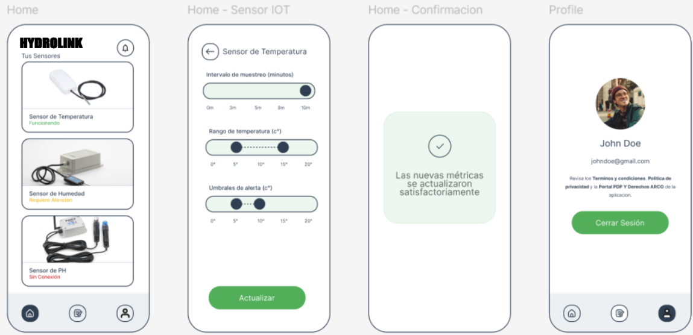

# Capítulo V: Solution UI/UX Design

## 5.1. Style Guidelines
Esta sección define las normas visuales y estéticas que seguirá nuestra startup para garantizar una identidad coherente en todos los canales y plataformas.

### 5.1.1. General Style Guidelines
Aquí se establecen los lineamientos generales de estilo que aseguran una representación visual unificada de nuestros productos.

Se especifica cómo utilizar correctamente el logotipo y los recursos visuales para reflejar los valores de sostenibilidad y comunidad que impulsa nuestra marca. A continuación, presentamos nuestro logotipo:

    

**Fuente principal:** Roboto

- Enlace de referencia: [Roboto Font](https://fonts.google.com/specimen/Roboto?query=roboto)

Se ha seleccionado esta tipografía por su legibilidad y versatilidad. Se emplearán estilos Regular, Medium, Semi-Bold y Bold, y tamaños que varían entre 16 px y 48 px dependiendo del contexto. Para los íconos, se usará el conjunto de Angular Material:

- Enlace de referencia: [Material Icons](https://www.angularjswiki.com/angular/angular-material-icons-list-mat-icon-list/)

**Colores corporativos:**

    

- **Principal:** Verde (#27AE60), que transmite sostenibilidad y conexión con el entorno agrícola.
- **Secundario:** Azul (#3498DB), asociado a la tecnología y confianza.
- **Neutro:** Blanco (#FFFFFF) como fondo para facilitar la lectura.
- **Contraste:** Gris oscuro (#2C3E50) usado en textos sobre fondos claros.

**Botones:**
- Acciones principales: botón verde con texto blanco.
- Acciones secundarias: botón azul con texto blanco.

**Estilos de texto:**
- Encabezado principal (H1): 32px en negrita.
- Subtítulos (H2): 24px en negrita.
- Texto base: 16px.
- Texto auxiliar: 14px en cursiva.

### 5.1.2. Web, Mobile and IoT Style Guidelines

#### Diseño web:
Presentación minimalista con estructura ordenada y bloques bien diferenciados con colores de fondo.
- Barra de navegación fija en la parte superior con accesos directos a las principales funcionalidades: Inicio, Panel, Dispositivos y Ajustes.

#### Diseño móvil:
- Menú lateral tipo "hamburguesa" para facilitar la navegación.
- Componentes con diseño táctil: botones grandes, espaciados adecuados.
- Uso de íconos sencillos y comprensibles para acciones frecuentes.

#### Diseño para IoT:
- Interfaces simples, orientadas a pantallas pequeñas.
- Datos esenciales (temperatura, humedad, etc.) mostrados de forma visual con colores de estado (verde = normal, amarillo = advertencia, rojo = alerta).

## 5.2. Information Architecture

### 5.2.1. Organization Systems
La estructura de la información se divide en los siguientes módulos:

1. **Panel de Control:** Muestra indicadores y gráficos de sensores en tiempo real.
2. **Dispositivos:** Gestión completa de sensores: añadir, editar o eliminar.
3. **Alertas:** Visualización y configuración de notificaciones automáticas.
4. **Configuraciones:** Preferencias del usuario y exportación de registros.

### 5.2.2. Labeling Systems
Las etiquetas utilizadas en la plataforma son claras, consistentes y amigables para distintos tipos de usuario:
- Ejemplos: "Sensor de Temperatura", "Nivel de Humedad", "Notificación de Riego".
- Se evita el uso de términos técnicos en interfaces generales, pero se brinda mayor detalle en secciones avanzadas.

### 5.2.3. SEO Tags and Meta Tags
A continuación, se detallan los metadatos usados en la página principal de **HydroLink**:

**Landing Page:**
- Título: `<title>Optimiza tus cultivos con HydroLink: Gestión inteligente y monitoreo IoT en tiempo real.</title>`
- Descripción:
  `<meta name="description" content="Controla, automatiza y mejora el cuidado de tus cultivos con sensores IoT y plataforma de monitoreo desde web y móvil." />`
- Palabras clave:
  `<meta name="keywords" content="IoT, agricultura, sensores, monitoreo de cultivos, automatización agrícola, agricultura inteligente" />`
- Autor:
  `<meta name="author" content="HydroLink" />`
- Derechos:
  `<meta name="copyright" content="© HydroLink 2024" />`

### 5.2.4. Searching Systems
La búsqueda se ha estructurado con base en filtros específicos para facilitar la navegación por grandes volúmenes de datos agrícolas.

| Elemento                           | Funcionalidad                                                                                      |
|-----------------------------------|----------------------------------------------------------------------------------------------------|
| Filtro con ícono de sensor        | Muestra información agrupada por tipo de sensor (temperatura, humedad, luz, etc).                |
| Clasificador por tipo de cultivo  | Permite filtrar resultados según el tipo de planta cultivada: hortalizas, frutas, hierbas, etc.  |

### 5.2.5. Navigation Systems
El diseño de navegación sigue principios de accesibilidad, claridad y consistencia.

- **Accesibilidad:** Máximo dos clics para acceder a las funcionalidades clave desde cualquier vista.
- **Unificación:** Los elementos visuales y navegación mantienen el mismo estilo tanto en web como en dispositivos móviles.
- **Retroalimentación:** Iconos activos, colores de confirmación y notificaciones aseguran una buena comprensión del estado de las acciones.

#### Menú de navegación en la Landing Page:
- Secciones principales:
    - Inicio
    - Visualización de Cultivos
    - Administración de Sensores
    - Sistema de Alertas
    - Centro de Soporte

- Botones destacados:
    - Crear cuenta / Iniciar sesión
    - Acceso rápido al panel de monitoreo

#### Menú de navegación en la Aplicación Web:
- Menú superior o lateral con las siguientes opciones:
    - **Panel Principal:** Visión general del estado actual de los cultivos.
    - **Datos en Tiempo Real:** Monitor interactivo con lectura en vivo de sensores.
    - **Gestión de Dispositivos:** Control y configuración de hardware IoT.
    - **Configuración de Alertas:** Creación de alertas según valores límite definidos.
    - **Historial y Reportes:** Visualización de métricas y exportación en PDF o Excel.
    - **Perfil de Usuario:** Datos personales, idioma, seguridad, y preferencias.

## 5.3. Landing Page UI Design

### 5.3.1. Landing Page Wireframe

**Prototipo en Figma:** https://www.figma.com/design/XNVO93oCaNIa24pvegEykM/Untitled?node-id=0-1&p=f&t=qVJfN9vOmhHBWZeW-0

### 5.3.2. Landing Page Mock-up

## 5.4. Applications UX/UI Design

El diseño UX/UI de las aplicaciones de HydroLink busca crear una experiencia fluida y accesible para todo tipo de usuario, asegurando que la interacción con el sistema de monitoreo IoT sea simple y efectiva.

### 5.4.1. Applications Wireframes

Los wireframes son representaciones visuales que permiten entender la estructura y distribución de elementos en cada vista de las aplicaciones móviles y web.

[Figma Wireframes](https://www.figma.com/design/dwgrf60ccxqQ5DoRSyMj0Q/MOBILE-FIGMA?node-id=0-1&p=f&t=BMJtpL2xYVLqCcYA-0)
//aca te quedaste

### 5.4.2. Applications Wireflow Diagrams

Estos diagramas muestran el recorrido lógico que realiza el usuario dentro de las aplicaciones, ayudando a identificar rutas de navegación, puntos de decisión y transiciones clave.

[Wireflow Figma](https://www.figma.com/board/lPbcfOseQklnlhEZEXio4I/HYDROLINK?node-id=0-1&t=WLD4Ma6jAl0RtTgs-1)

### 5.4.3. Applications Mock-ups

[Figma Mockups](https://www.figma.com/design/9wb3lGc5giLV4KEyFty6bf/Mobile-Mockups-and-Prototyping?node-id=0-1&t=BjmklCBhCvcbcuJN-1)

### 5.4.4. Applications User Flow Diagrams

[Figma User Flow](https://www.figma.com/board/Ik78rH11emEGTPXNVfI7Mt/Untitled?node-id=0-1&t=6rvRf5q9NhL7tNPn-1)

## 5.5. Applications Prototyping

[Figma Prototype](https://www.figma.com/proto/9wb3lGc5giLV4KEyFty6bf/Application-Mockups?node-id=12-29&node-type=canvas&t=Y2X2EgX3WIX3EKtB-1&scaling=scale-down&content-scaling=fixed&page-id=0%3A1&starting-point-node-id=12%3A29&share=1)

